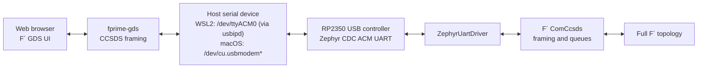
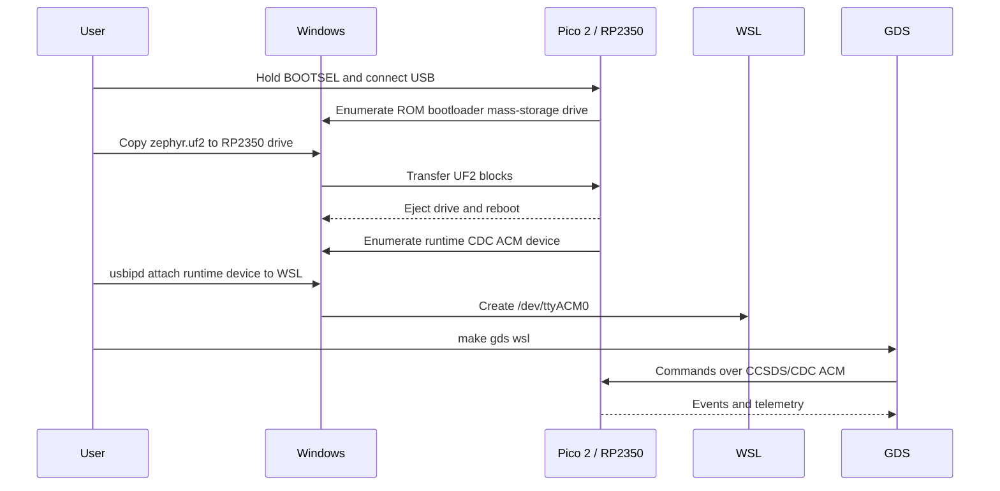
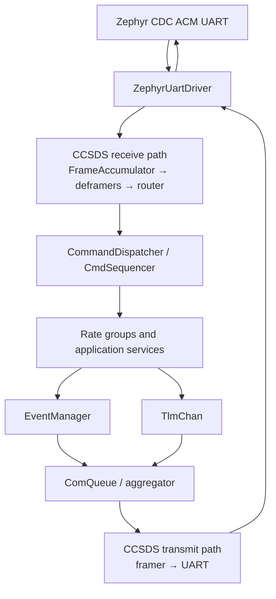

# FprimeBilleeRcm F´ on RP2350

This deployment runs the complete F´ CDH, CCSDS communications, data-product,
file-handling, sequencing, health, telemetry, and rate-group topology on a
stock Raspberry Pi Pico 2 (`rpi_pico2/rp2350a/m33`). Communications use USB
CDC ACM, so the same USB connector used for BOOTSEL becomes a serial device
after the firmware starts.

Hardware-verified end-to-end (build, flash, GDS connection, live telemetry)
on **macOS**. The build system and this guide also support **WSL2/Windows**,
the platform this project was originally designed around, though that path
has not been re-verified against the current source since macOS support was
added.

## Quick start

```bash
make setup          # create the Python venv
make setup-zephyr    # fetch Zephyr + SDK (slow, one-time)
make build-rp2350    # build build-artifacts/zephyr.uf2
```

Then flash and connect using whichever platform section below matches your
host: [macOS](#flash-and-run--macos) or [WSL2/Windows](#flash-and-run--wsl2windows).

## Flash and run — macOS

1. Hold **BOOTSEL** while plugging the Pico 2 into your Mac (or while pressing
   its reset button, if the board has one wired).
2. It mounts as a `RP2350` (or `RPI-RP2`) mass-storage volume. Copy the UF2
   over, or let Make do it once you know the volume path:
   ```bash
   make cpfirm mac                          # copies to $MAC_BOOTSEL_VOLUME
   MAC_BOOTSEL_VOLUME=/Volumes/RP2350 make cpfirm mac   # override if it mounts elsewhere
   ```
3. The board reboots automatically once the copy finishes and re-enumerates as
   a USB CDC-ACM serial device, typically `/dev/cu.usbmodem2101`. Confirm with:
   ```bash
   ls -la /dev/cu.usbmodem*
   ```
4. Start GDS:
   ```bash
   make gds mac                             # uses $MAC_UART_DEVICE, default /dev/tty.usbmodem2101
   ```
   Open the printed URL (normally `http://127.0.0.1:5000`) and check the
   Events/Channels tabs for live data.

If `make gds mac` shows no traffic even though the port exists, see
[15.10 macOS: GDS connects but shows no traffic](#1510-macos-gds-connects-but-shows-no-traffic)
before assuming the firmware is broken — a stuck background `fprime-gds`
process silently holding the port is a common, easy-to-miss cause.

## Flash and run — WSL2/Windows

1. Unplug the Pico 2.
2. Hold BOOTSEL while plugging it into Windows.
3. Copy `build-artifacts/zephyr.uf2` to the `RP2350` mass-storage drive.
4. Wait for the drive to eject itself and the board to reboot.

BOOTSEL mode is only the bootloader and will not expose the F´ serial
connection. After reboot, Windows should show a new **USB Serial Device
(COMx)**. The development firmware identifies as USB `2FE3:0004`; `2E8A:000F`
is the separate RP2350 BOOTSEL device.

Check Windows PowerShell with:

```powershell
[System.IO.Ports.SerialPort]::GetPortNames()
Get-PnpDevice -Class Ports | Format-Table Status,FriendlyName,InstanceId
```

Windows owns USB devices by default. Install `usbipd-win`, then, after the
flashed board has rebooted, identify and attach the **USB Serial Device**:

```powershell
usbipd list
usbipd bind --busid <BUSID>
usbipd attach --wsl --busid <BUSID>
```

`bind` requires an Administrator PowerShell; `attach` does not. Keep WSL open
while attaching. In WSL, verify the result and start GDS:

```bash
ls -l /dev/ttyACM*
make gds wsl
```

If the device is not `/dev/ttyACM0`, select it explicitly:

```bash
UART_DEVICE=/dev/ttyACM1 make gds
```

While attached to WSL, the device is unavailable to Windows applications. To
return it to Windows:

```powershell
usbipd detach --busid <BUSID>
```

See section 15 below for troubleshooting, and section 5.6 for the F´ 4.2.2 /
fprime-zephyr / Zephyr 4.3 compatibility-layer details.


# F´ on RP2350 with Zephyr

## Software Design Description and Reproducible Setup Guide

| Field | Value |
| --- | --- |
| Project | FprimeBilleeRcm |
| Target board | Stock Raspberry Pi Pico 2 |
| SoC/core target | `rpi_pico2/rp2350a/m33` |
| F´ | `v4.2.2` |
| fprime-zephyr | `8ef1f4e62c6ee4f04598fdb25ceb82b645687af5` |
| Zephyr | `v4.3.0` |
| Zephyr SDK | `0.17.4`, ARM toolchain |
| Host validated | macOS (hardware-verified); Ubuntu 22.04 under WSL2 (original design target, not re-verified against current source) |
| Firmware transport | USB CDC ACM carrying F´ CCSDS frames |
| Document status | Hardware-verified on macOS: builds, flashes, boots, and exchanges live telemetry/commands over GDS |

## 1. Purpose

This document describes the design and a repeatable, checkpoint-driven
procedure for building, flashing, and operating the full F´ deployment on a
stock Raspberry Pi Pico 2. It records the changes required to make the
deployment boot within the RP2350's RAM and enumerate as a serial device.

The procedure deliberately distinguishes two USB states:

1. **BOOTSEL mode** is the RP2350 ROM bootloader and exposes a mass-storage
   drive used only to copy the UF2.
2. **Runtime mode** is this Zephyr firmware and exposes a CDC ACM serial
   device used by F´ GDS.

Confusing those states is the most common reason for looking for a COM port
while the board is still in BOOTSEL mode.

## 2. Scope

This guide covers:

- fresh macOS or WSL2/Ubuntu host setup;
- project and submodule checkout;
- Python, West, Zephyr module, and SDK installation;
- the RP2350-specific F´ and Zephyr design;
- clean firmware generation and build;
- UF2 validation and BOOTSEL flashing (both platforms);
- macOS USB serial inspection, or Windows USB/COM inspection plus passing the
  runtime device into WSL2;
- starting F´ GDS with the correct dictionary and framing;
- acceptance checks and troubleshooting.

This guide does not cover:

- a custom RP2350 PCB or a Pico 2 W;
- SWD debugging;
- production USB VID/PID assignment;
- persistent flash filesystems;
- performance qualification or flight certification.

For a custom board, create a Zephyr board definition that matches its flash,
clock, pin, and USB wiring. Do not assume the Pico 2 board target is correct.

## 3. Design goals and requirements

| ID | Requirement | Implementation |
| --- | --- | --- |
| R-01 | Build for the stock Pico 2 Cortex-M33 target | `BOARD=rpi_pico2/rp2350a/m33` |
| R-02 | Produce an RP2350-compatible UF2 | Zephyr emits family ID `0xe48bff57` |
| R-03 | Expose runtime communications over the board's USB connector | CDC ACM devicetree overlay |
| R-04 | Preserve the complete selected F´ topology | CDH, CCSDS, data products, file handling, sequencing, health, telemetry, and rate groups remain present |
| R-05 | Start every active component | 17-entry dynamic thread pool with matching 8 KiB stacks |
| R-06 | Leave sufficient runtime heap | Trimmed per-component queue depths (see Section 5.5); embedded buffer, catalog, parameter, sequence, and telemetry capacities |
| R-07 | Use the topology's wire protocol in GDS | `space-packet-space-data-link` framing (fprime-gds's default) |
| R-08 | Support GDS from macOS or WSL2 | `make gds mac` / `make gds wsl`; `usbipd-win` attachment plus `/dev/ttyACM*` or `/dev/cu.usbmodem*` launcher |

## 4. System architecture

### 4.1 Runtime communication path



USB CDC is a byte stream. The baud-rate value is retained for the UART API and
GDS configuration, but USB does not transmit bits at a physical 115200-baud
UART clock.

The entry point sleeps for a flat 3 seconds before constructing the F´
topology, to let the USB CDC-ACM class finish enumerating before anything
tries to write to it — writes attempted too early are silently dropped, not
queued. An earlier version of this gate instead polled for the host to assert
the CDC DTR signal and blocked indefinitely until it did; that was replaced
because not every host's CDC-ACM driver relays DTR reliably (see 5.7), and a
bounded delay is simpler and works everywhere. If startup events are ever
observed to still be dropped in practice, extend the delay rather than
reintroducing a DTR wait.

### 4.2 Flash and runtime USB states

This is the WSL2/Windows flow specifically, since it has an extra hop
(`usbipd`) that macOS doesn't need — on macOS, step 4 is simply "the board
re-enumerates as `/dev/cu.usbmodem*` directly usable by GDS."



### 4.3 Firmware composition

The deployment uses Zephyr-native time, rate, task, file, mutex, queue, raw
time, console, and UART implementations. The principal data flow is:



## 5. Why the stock defaults did not boot

The project originally generated a valid-looking UF2 but contained several
runtime blockers.

### 5.1 No runtime USB serial device

Without a project board overlay, Zephyr selected hardware `uart0` on GPIO 0 and
GPIO 1 as `zephyr,console`. Copying the UF2 therefore did not cause Windows to
discover a runtime COM port on the USB connector.

The file `boards/rpi_pico2_rp2350a_m33.overlay` now:

- creates a `zephyr,cdc-acm-uart` node under `zephyr_udc0`;
- selects that node as `zephyr,console`;
- allows `ZephyrUartDriver` to use the USB device selected by
  `DT_CHOSEN(zephyr_console)`.

### 5.2 Too few task slots

The complete topology starts 17 active-component tasks (one more than the
original 16 once `Billee.SubsystemManager` was added), while the original
Zephyr configuration provisioned 12 dynamic stacks. Tasks beyond the pool
capacity could not start.

`prj.conf` now sets:

```text
CONFIG_DYNAMIC_THREAD_POOL_SIZE=17
```

Don't set this from a guess — count the actual `.start()` calls generated in
`rp2350DeploymentTopologyAc.cpp::startTasks()` after any topology change. This
value must be *exactly* the active-task count, not merely `>=` it: unlike
most "headroom" settings, over-provisioning here isn't free — every extra
slot costs a full `CONFIG_DYNAMIC_THREAD_STACK_SIZE` of static RAM whether or
not a task ever uses it, and that RAM competes directly with the heap (see
5.5 below).

### 5.3 Stack-size mismatch

F´ reference subtopologies requested 64 KiB task stacks. Zephyr's dynamic
thread pool was configured for a different fixed stack size. The Zephyr task
allocator requires every dynamically allocated F´ task stack to request the
configured size exactly, and this project-controlled value
(`Default.STACK_SIZE` in `rp2350Deployment/Top/instances.fpp`) isn't the only
place stack size is set: `config/rp2350-overrides/CdhCoreConfig.fpp`
independently pins `cmdDisp`/`events`/`tlmSend`'s stacks to a hardcoded
`8 * 1024`, so those three tasks must be updated too if this value ever
changes. Miss one and boot fails with `ActiveComponentBase.cpp` asserting
`Os::Task::Status::ERROR_RESOURCES` (ask for a stack the pool's per-slot
size can't satisfy) partway through `startTasks()`.

All 17 active components and `CONFIG_DYNAMIC_THREAD_STACK_SIZE` use 8 KiB.
The Zephyr main thread also stays at 8 KiB (a separate, independent setting —
it isn't an F´ task stack, so it isn't part of the "must match" constraint).
8 KiB was deliberately kept rather than shrunk to claw back heap room for the
reasons in 5.5 below; see that section for how the heap shortfall was
actually resolved instead.

### 5.4 Desktop capacities exceeded RP2350 RAM

The Pico 2 has 520 KiB RAM. Default F´ queue and buffer capacities are intended
for larger systems. Notable defaults included hundreds of full communication
buffers, a 127-file data-product catalog, a large sequence dictionary, and a
500-bucket telemetry database.

No topology or service was removed. Instead, `config/rp2350-overrides` sizes
the same services for an embedded deployment:

| Resource | RP2350 capacity |
| --- | ---: |
| Active task stacks | 17 × 8 KiB |
| CDH command queue | 8 |
| CDH event queue | 16 |
| CDH health-ping queue | 16 |
| CCSDS `comQueue` async-port queue | 16 |
| Communications packet queues | 16 events, 32 telemetry, 4 file |
| Communications buffers | 6 normal + 2 file, 1024 bytes each |
| Data-product buffers | 2 × 1024 bytes |
| Data-product catalog | 16 files in 2 directories |
| Fpy sequence dictionary | 128 statements, 8 arguments |
| Fpy sequence stack | 2048 bytes |
| Parameter database | 8 entries |
| Telemetry database | 96 buckets |

These are capacity limits, not feature exclusions. If the topology grows,
recalculate them and maintain the invariants in Section 14.

### 5.5 The real remaining bug: heap exhaustion from per-component queue depths

Getting the numbers in 5.1–5.4 right was necessary but not sufficient — the
firmware still built and linked cleanly, flashed, and enumerated as a USB
serial device, yet produced *no output at all* on the wire. That silence had
nothing to do with USB, DTR, or the console; it took directly instrumenting
`initComponents()` with a binary-search heap probe (find the largest single
`malloc()` that still succeeds) between every component's `.init()` call to
find the actual cause.

Every F´ active/queued component allocates its own async-port message queue
from the heap during `.init()` — sized as `queue depth × largest message
size` for that component, roughly 565–570 bytes per queue slot in this
topology. That's ordinary, expected F´ behavior, not a bug by itself. The
problem was that `initComponents()` alone consumed **~86 KiB** of the
~123 KiB heap the linker's map said should be free (`_end` to top of RAM,
Zephyr's `CONFIG_COMMON_LIBC_MALLOC_ARENA_SIZE=-1` auto-sizing), leaving too
little for two allocations that happen afterward, during `configComponents()`
and this project's own `configureTopology()`:

- `Svc::BufferManager` (`dpBufferManager`, the data-product buffer pool)
  asserting in `BufferManagerComponentImpl.cpp:163` on a failed 2240-byte
  allocation;
- once that was fixed, `Svc::CmdSequencer`'s 5 KiB command-sequence buffer
  allocation failing the same way, asserting in `Fw/Types/Serializable.cpp`
  when the resulting null pointer got passed into a serialize buffer.

The single largest per-component consumer, by a wide margin, was
`CdhCore::health`'s ping queue: **18 KiB** for a queue depth of 32, even
though only 12 components actually ping health
(`NUM_PING_ENTRIES` in the generated topology). `ComCcsds::comQueue`'s own
async-port queue was next at **13.6 KiB** for a depth of 24. Reducing both to
16 (`config/rp2350-overrides/CdhCoreConfig.fpp` and `ComCcsdsConfig.fpp`)
freed enough margin for both failing allocations, with headroom to spare.

Two things that looked like plausible fixes turned out not to be, and are
recorded here so they aren't retried blindly:

- **A fixed-size static heap arena** (`CONFIG_COMMON_LIBC_MALLOC_ARENA_SIZE`
  set to an explicit byte count instead of left at `-1`/auto) reproducibly
  made boot fail *earlier and harder* than the undersized auto-heap did —
  confirmed with a reliable capture method, not a fluke. Left unset
  deliberately; if heap headroom is needed again, prefer trimming queue
  depths as above.
- **Shrinking `CONFIG_DYNAMIC_THREAD_STACK_SIZE`** below 8192 to free static
  RAM for the heap doesn't work without also updating
  `config/rp2350-overrides/CdhCoreConfig.fpp` (see 5.3) — an unmatched value
  fails immediately with `ERROR_RESOURCES`. A non-power-of-two size (6144 was
  tried) failed the same way even after matching both places, likely an ARM
  Cortex-M33 MPU stack-guard alignment requirement; 4096 (a proper power of
  two, and what the sibling
  [PROVES flight controller reference project](https://github.com/Open-Source-Space-Foundation/proves-core-reference)
  runs successfully with a larger, more-threaded topology on the same
  `rp2350a/m33` core) also worked mechanically, but was reverted in favor of
  the queue-depth fix once it was clear 8 KiB stacks were never actually the
  scarce resource.

If a future change reintroduces a heap-allocation failure, the diagnostic
technique that actually found this — a binary-search `malloc()` probe
between successive initialization steps, comparing against a reliable serial
capture (see 5.7) — is far more direct than guessing at capacity numbers.

**This happened a second time**, when `Billee::McpManager` (an I2C temperature
manager) was added as a new active component. The new component itself was
not the problem — bisecting it out of the topology entirely, and even
reverting every other file to the exact last-committed, previously-verified
build, still reproduced the identical silent hang, which ruled out both the
new component and a hardware/environment explanation. The heap probe (this
time instrumenting `configComponents()` step by step rather than just
`initComponents()`) found a second, previously invisible consumer:
`ComCcsds::comQueue.configure()` — called from `configComponents()`, not
`initComponents()` — allocates its own internal priority-queue storage sized
by `ComCcsdsConfig::QueueDepths` (`events`, `tlm`, `file`). At the stock
values (16/32/4) this single call cost **26 KiB**, more than any other single
allocation in the whole boot sequence, including every active component's
message queue combined. This is a completely different setting from
`ComCcsdsConfig::QueueSizes::comQueue` (that component's own async-port
message queue, already reduced once in the paragraphs above) — same
component, two unrelated heap costs, easy to fix one and not know the other
exists. See Section 14.4 for the general methodology this incident fed back
into.

### 5.6 F Prime 4.2.2 / fprime-zephyr / Zephyr 4.3 compatibility layer

F´ `v4.2.2` and this revision of `fprime-zephyr` come from different points
in F´'s development and are not fully compatible out of the box. This
project carries a small, self-contained compatibility layer rather than
patching either submodule directly.

**Load Zephyr before F´.** The top-level `CMakeLists.txt` initializes Zephyr
(`find_package(Zephyr ...)`) before calling `project()`, so Zephyr can select
the board, SDK, compiler, device tree, and application target before F´
configures the deployment:

```cmake
cmake_minimum_required(VERSION 3.24.2)

if (NOT BUILD_TESTING)
    find_package(Zephyr HINTS "${CMAKE_CURRENT_LIST_DIR}/lib/zephyr-workspace")
endif()

project(FprimeBilleeRcm C CXX)
```

**Attach the deployment to Zephyr's `app` target.** Without this, Zephyr's
`app` target never receives `Main.cpp` or the topology, and configuration
fails with `No SOURCES given to target: app`:

```cmake
add_fprime_subdirectory("${CMAKE_CURRENT_LIST_DIR}/FprimeBilleeRcm")
add_fprime_subdirectory("${CMAKE_CURRENT_LIST_DIR}/rp2350Deployment")
```

**Project-local deployment registration.** The `fprime-zephyr` revision this
project pins expects an installation helper
(`lib/fprime/cmake/target/fprime_install.cmake`) and an
`Os_CountingSemaphore_Stub` implementation target, neither of which exists in
F´ 4.2.2. `cmake/register_fprime_zephyr_4_2_2_deployment.cmake` supplies both:
it mirrors `fprime-zephyr`'s registration behavior (adds `Main.cpp` to the
`app` target, links the topology, creates the dictionary and artifact
install targets) and runs the generated installer directly instead of
calling the missing helper. An empty `Os_CountingSemaphore_Stub` interface
target is defined after F´ and its libraries load — safe here because this
deployment never uses the newer counting-semaphore interface. If a future F´
upgrade adds real support for either, remove the corresponding shim rather
than keep it around unnecessarily.

**Zephyr task-handle size.** F´ 4.2.2 defaults `FW_TASK_HANDLE_MAX_SIZE` to
40 bytes; Zephyr 4.3's `Os::Zephyr::Task::ZephyrTask` is 168 bytes, which
fails to compile (`static assertion failed: Handle size not large enough`)
against that default. `FprimeBilleeRcm/Config/PlatformCfg.fpp` overrides it
to 192 bytes (with headroom for alignment).

**Telemetry database size.** F´'s default `TlmChanImplCfg.hpp` reserves 500
hash buckets, each sized for a full telemetry value — roughly 590 KiB total,
which alone exceeds the RP2350's 520 KiB RAM. `FprimeBilleeRcm/Config/TlmChanImplCfg.hpp`
reduces this to 96 buckets. This must stay `>=` the deployment's actual
telemetry-channel count; recheck after adding channels.

**Linux-only components replaced with Zephyr equivalents:**

| Linux component | Zephyr component |
| --- | --- |
| `Svc.LinuxTimer` | `Zephyr.ZephyrRateDriver` |
| `Drv.LinuxUartDriver` | `Zephyr.ZephyrUartDriver` |
| `Svc.ChronoTime` | `Zephyr.ZephyrTime` |

`Svc.ChronoTime` specifically can't be used here — its standard-library clock
path needs `gettimeofday`, which this Zephyr configuration doesn't provide.

**UART setup.** The UART driver uses Zephyr's chosen console device
(`DT_CHOSEN(zephyr_console)`) at 115200 baud. Unlike `Drv::LinuxUartDriver`,
`Zephyr::ZephyrUartDriver` has no dedicated POSIX receive thread — its
`schedIn` port must be driven periodically by a rate group
(`rateGroup1.RateGroupMemberOut[5] -> comDriver.schedIn`).

**Rate driver.** `Zephyr::ZephyrRateDriver` wraps a Zephyr kernel timer,
configured in milliseconds, started once, then cycled continuously in
`startRateGroups()` (`timer.configure()` → `timer.start()` →
`while (true) { timer.cycle(); }`) — this loop runs for the firmware's
lifetime; there's no desktop-style Ctrl-C teardown path.

**Config filename.** The Kconfig file must be named `prj.conf` — Zephyr
auto-detects that name specifically; `proj.conf` is not recognized.

### 5.7 macOS-specific gotchas

None of these are bugs in the firmware; they're host-side traps that
repeatedly produced misleading "it's not working" symptoms during bring-up,
worth knowing about before re-debugging them from scratch.

- **Raw `cat`/`stty` captures are not reliable on macOS.** Neither tool
  asserts the CDC-ACM DTR line the way a real serial client does, and this
  firmware's boot path doesn't depend on DTR at all (see 5.6's UART setup) —
  so DTR isn't the reason `cat` misses data, but something about how macOS's
  native CDC-ACM driver handles a bare `open()` without it evidently is. A
  small `pyserial` script that explicitly sets `port.dtr = True` on open
  reliably captured boot output when raw `cat` reliably didn't. If you need
  to manually inspect what a board is transmitting, use `pyserial`
  (`serial.Serial(device, baud); port.dtr = True; port.read(...)`), not
  `cat`/`dd`/`stty`.
- **The port can end up silently held by a stale process.** A backgrounded
  `fprime-gds` (or its `comm`/`CustomDataHandlers` sub-processes) that wasn't
  fully killed keeps `/dev/cu.usbmodem*` open indefinitely, and a *second*
  `fprime-gds` session can start up cleanly against the same dictionary
  without ever reporting a conflict — it just never receives anything. If
  GDS or a raw capture reports total silence, check for leftover
  `fprime_gds.executables.*` processes (`ps aux | grep fprime_gds`) before
  assuming the firmware is broken.
- **`/dev/cu.*` vs `/dev/tty.*`.** Both refer to the same underlying USB CDC
  device, but `/dev/cu.*` ("callout") is the correct one for a program
  actively opening the connection; `/dev/tty.*` is dial-in-oriented and can
  behave differently. This project's `MAC_UART_DEVICE` default and
  `uart_gds.sh` both use `/dev/tty.usbmodem2101` and this has worked in
  practice, but if a capture behaves strangely, try the `/dev/cu.*` path.
- **Build failures can hide behind a `| tail -N` pipe without failing the
  overall command.** `some-build-command | tee log | tail -60` reports the
  exit status of `tail` (always 0), not the build — so a real link failure
  partway through can go completely unnoticed while a *stale* `.uf2` from an
  earlier successful build keeps getting reflashed and tested. This cost
  significant time during bring-up: several "still not working" reports
  turned out to be repeated tests of an old binary, not the change actually
  being tested. Check exit codes explicitly (`cmd; echo $?`, or redirect to a
  log file and check `$?` directly) rather than trusting a piped command's
  own exit status.

## 6. Verified baseline

This build was verified end-to-end on real hardware: it links, flashes,
boots, enumerates as a USB CDC-ACM serial device, and exchanges live
telemetry and commands with `fprime-gds` over the CCSDS space-packet
framing.

```text
FLASH: 417640 B / 4 MB      9.96%
RAM:   406648 B / 520 KB   76.37%
UF2 family: RP2350 (0xe48bff57)
Generated active stacks: 17 × 8192 bytes
USB runtime VID:PID: 2FE3:0004
```

The linker-reported RAM is static usage only. The remaining ~123 KiB
(auto-sized heap, `_end` to top of RAM) is what F´'s per-component queues,
buffer pools, catalogs, and the sequence buffer allocate at runtime — see
5.5 for why that number is tighter than it looks and how it was actually
verified sufficient (a runtime heap-probe, not just the static linker
report).

A given source tree's UF2 will hash differently across otherwise-identical
builds (embedded build timestamps, path strings, etc.), so no fixed
reference hash is recorded here — a different hash alone never indicates a
failure. Verify a build by its behavior (Section 13's acceptance checklist),
not by comparing hashes.

## 7. Required equipment and host software

### 7.1 Hardware

- Raspberry Pi Pico 2 with RP2350A;
- known-good USB data cable;
- a Mac, a Windows PC with WSL2, or a native Linux PC;
- a direct USB port for initial troubleshooting, avoiding an unpowered hub.

Some USB cables supply power but have no data wires. Such a cable can power the
board without ever creating a drive or COM port.

### 7.2 macOS

No extra host software beyond Xcode Command Line Tools (`xcode-select --install`,
for `git`/`make`/a C toolchain) and Python 3.9+ (via Homebrew or
[python.org](https://python.org)) — the Zephyr SDK and toolchain are fetched
into the project's own venv by `make setup-zephyr`. There's no USB/IP hop to
set up; the board's CDC-ACM device appears directly as `/dev/cu.usbmodem*`.

### 7.3 Windows and WSL2

Recommended:

- current Windows 11;
- current WSL2;
- Ubuntu 22.04 or newer;
- `usbipd-win` 5.0 or newer.

In Administrator PowerShell:

```powershell
wsl --update
winget install --interactive --exact dorssel.usbipd-win
```

Restart Windows if the installer requests it. Confirm the distribution uses
WSL2:

```powershell
wsl --list --verbose
```

### 7.4 Ubuntu packages

In WSL Ubuntu:

```bash
sudo apt-get update
sudo apt-get install --no-install-recommends \
  git cmake ninja-build gperf ccache dfu-util device-tree-compiler wget \
  python3 python3-dev python3-pip python3-setuptools python3-tk \
  python3-venv python3-wheel xz-utils file make gcc gcc-multilib \
  g++-multilib libsdl2-dev libmagic1 usbutils
```

F´ 4.2.2 requires Python 3.9 or newer. Check it before proceeding:

```bash
python3 --version
```

The project installs CMake 3.26.0 inside its virtual environment, so Ubuntu
22.04's older system CMake does not need to be replaced.

## 8. Fresh project setup

On WSL2, run all commands below from the WSL shell, not PowerShell. On
macOS, run them from Terminal as-is.

### 8.1 Clone

```bash
git clone --recurse-submodules <repository-url> fprime-billee-rcm
cd fprime-billee-rcm
git submodule update --init --recursive
```

Checkpoint:

```bash
git submodule status
```

Expected pinned revisions:

```text
8a62e455a90b6d4f498c332d45d65a2a819988d8 lib/fprime (v4.2.2)
8ef1f4e62c6ee4f04598fdb25ceb82b645687af5 lib/fprime-zephyr
```

`lib/fprime` and `lib/fprime-zephyr` are third-party pins — do not
independently update either; the project contains a small compatibility
layer for this exact F´/fprime-zephyr combination (Section 5.6).
`lib/fprime-billee` is this project's own component library (the
`Billee.SubsystemManager` component that drives the drivetrain/arm/science/
aux power-enable GPIOs) and lives on its own `lucadev` branch — its history
moves independently of, and should stay in sync with, the outer repo's
`lucadev` branch.

### 8.2 Create the Python environment

```bash
make setup
```

To choose a specific Python installation:

```bash
make setup PYTHON=python3.12
```

Checkpoint:

```bash
./fprime-venv/bin/python --version
./fprime-venv/bin/cmake --version
./fprime-venv/bin/fprime-util version-check
```

The CMake line must report 3.24.2 or newer; this pinned environment reports
3.26.0.

### 8.3 Fetch Zephyr dependencies and install the toolchain

```bash
make zephyr-setup
```

This performs:

1. installation of West in the project virtual environment;
2. `west update` using the pinned `west.yml`;
3. installation of Zephyr's Python packages;
4. installation of the `arm-zephyr-eabi` Zephyr SDK toolchain.

The downloads are substantial and require internet access.

Checkpoint:

```bash
./fprime-venv/bin/west topdir
./fprime-venv/bin/west sdk list
test -f lib/zephyr-workspace/zephyr/zephyr-env.sh
```

`west topdir` must print the project root, and SDK output must show an installed
ARM toolchain. The validated SDK version is 0.17.4.

## 9. Build procedure

From the repository root:

```bash
make build-rp2350
```

The target removes the previous Zephyr build, regenerates for
`rpi_pico2/rp2350a/m33`, builds, and installs artifacts. A clean generation is
intentional: stale devicetree or FPP output can hide configuration changes.

Successful output ends with memory usage and:

```text
Converted to uf2
make build-rp2350 complete
```

Required artifacts:

```bash
test -f build-artifacts/zephyr.uf2
test -f build-artifacts/zephyr.elf
test -f build-artifacts/zephyr.map
test -f build-artifacts/zephyr/fprime-zephyr-deployment/dict/rp2350DeploymentTopologyDictionary.json
ls -lh build-artifacts/zephyr.uf2
```

### 9.1 Validate the generated configuration

Run these checks before flashing a configuration change:

```bash
grep -E \
  'CONFIG_DYNAMIC_THREAD_(STACK_SIZE|POOL_SIZE)|CONFIG_MAIN_STACK_SIZE' \
  build-fprime-automatic-zephyr/zephyr/.config
```

Expected:

```text
CONFIG_MAIN_STACK_SIZE=8192
CONFIG_DYNAMIC_THREAD_STACK_SIZE=8192
CONFIG_DYNAMIC_THREAD_POOL_SIZE=17
```

Check the USB node and chosen console:

```bash
grep -nE 'zephyr,console|cdc_acm_uart0|zephyr,cdc-acm-uart' \
  build-artifacts/zephyr.dts
```

The chosen console must reference `cdc_acm_uart0`.

Check all generated task stacks:

```bash
grep -n '= 8192' \
  build-fprime-automatic-zephyr/rp2350Deployment/Top/rp2350DeploymentTopologyAc.hpp
```

There must be 17 active-component stack entries.

Check the UF2 family:

```bash
./fprime-venv/bin/python \
  lib/zephyr-workspace/zephyr/scripts/build/uf2conv.py \
  -i build-artifacts/zephyr.uf2
```

Expected:

```text
Family ID is RP2350, hex value is 0xe48bff57
Target Address is 0x10000000
```

## 10. Flash procedure

1. Disconnect the Pico 2.
2. Hold the **BOOTSEL** button.
3. While holding BOOTSEL, connect the USB data cable to Windows.
4. Release BOOTSEL after a mass-storage drive named `RP2350` appears.
5. Copy `build-artifacts/zephyr.uf2` from WSL to the Windows-visible drive.
6. Wait for the copy to finish.
7. The drive should automatically eject and the board should reboot.

The BOOTSEL device has Raspberry Pi USB identity `2E8A:000F`. That identity is
not the runtime F´ serial device and must not be used as the expected GDS port.

If dragging directly from a Windows application, the WSL file is available
through:

```text
\\wsl$\<distribution-name>\<absolute-linux-path>
```

For example, open `\\wsl$\Ubuntu\home\...` in Windows Explorer and navigate to
`build-artifacts`.

## 11. Confirm runtime USB on Windows

After flashing, do not hold BOOTSEL. Unplug and reconnect normally if
necessary.

In PowerShell:

```powershell
[System.IO.Ports.SerialPort]::GetPortNames()
Get-PnpDevice -Class Ports | Format-Table Status,FriendlyName,InstanceId
```

Expected result:

```text
USB Serial Device (COMx)
```

The development firmware uses runtime USB identity `2FE3:0004`. This is
Zephyr's development CDC identity, not a production VID/PID.

To inspect all present matching USB devices:

```powershell
Get-PnpDevice -PresentOnly |
  Where-Object {
    $_.InstanceId -match 'VID_2FE3&PID_0004|VID_2E8A&PID_000F'
  } |
  Format-Table Status,Class,FriendlyName,InstanceId
```

Interpretation:

| Observed device | Meaning |
| --- | --- |
| `VID_2E8A&PID_000F`, mass storage | Board is in BOOTSEL mode |
| `VID_2FE3&PID_0004`, Ports/COM | Runtime firmware and CDC ACM started |
| No device in either state | Cable, connector, hub, USB host, or board-power problem |
| BOOTSEL works but runtime device never appears | UF2/firmware startup or Windows enumeration problem |

## 12. Attach the runtime device to WSL2

WSL2 does not automatically receive Windows USB devices. Keep a WSL terminal
open, then list devices in PowerShell:

```powershell
usbipd list
```

Select the BUSID for the **runtime USB Serial Device**, not `RP2350 Boot`.
If the board is already attached, `usbipd list` should show the device as
`Attached`.

Share it once from **Administrator PowerShell**:

```powershell
usbipd bind --busid <BUSID>
```

Attach it from ordinary PowerShell:

```powershell
usbipd attach --wsl --busid <BUSID>
usbipd list
```

While attached to WSL, Windows applications cannot use that COM port. This is
expected.

In WSL:

```bash
lsusb
ls -l /dev/ttyACM*
```

Expected USB identity:

```text
2fe3:0004
```

Expected serial node:

```text
/dev/ttyACM0
```

If permissions deny access:

```bash
id
sudo usermod -aG dialout "$USER"
```

Then close all WSL terminals, run `wsl --shutdown` from PowerShell, reopen WSL,
reattach the device, and check again. Do not run GDS permanently with `sudo`.

When finished:

```powershell
usbipd detach --busid <BUSID>
```

USB attachment is not persistent across unplugging, board reset, or WSL
shutdown. Re-run `usbipd attach` whenever `/dev/ttyACM*` disappears.

Example WSL session on Ubuntu 22.04:

```powershell
usbipd list
usbipd attach --wsl --busid 2-4
usbipd list
```

Expected host-side result after attachment:

```text
2-4    2fe3:0004  USB Serial Device (COM4)  Attached
```

Then verify inside WSL:

```bash
lsusb
ls -l /dev/ttyACM*
```

Expected device identity and serial node:

```text
2fe3:0004
/dev/ttyACM0
```

## 13. Start F´ GDS

From the repository root in WSL:

```bash
make gds wsl
```

The launcher verifies:

- the project virtual environment contains `fprime-gds`;
- the generated RP2350 dictionary exists;
- the selected serial device is a character device.

It then starts GDS with:

- no local deployment executable;
- the generated RP2350 dictionary;
- UART communication;
- `space-packet-space-data-link` CCSDS framing;
- `/dev/ttyACM0` at the API value 115200.

If Linux assigned a different number:

```bash
UART_DEVICE=/dev/ttyACM1 make gds wsl
```

Open the URL printed by GDS, normally:

```text
http://127.0.0.1:5000
```

Windows normally forwards WSL localhost automatically. If the browser cannot
connect, confirm GDS is still running and no other process already owns port
5000.

### 13.1 End-to-end acceptance test

The setup is accepted only when all of the following pass:

- [ ] `make build-rp2350` exits successfully.
- [ ] Static linked RAM remains below the RP2350's 520 KiB.
- [ ] UF2 inspection reports family `0xe48bff57`.
- [ ] The BOOTSEL drive ejects after copying the UF2.
- [ ] Windows shows runtime `VID_2FE3&PID_0004`.
- [ ] Windows shows `USB Serial Device (COMx)`.
- [ ] `usbipd list` shows the runtime device as attached.
- [ ] WSL shows `/dev/ttyACM*`.
- [ ] `make gds wsl` starts without a missing-device error.
- [ ] GDS displays events or telemetry from the board.
- [ ] A safe command sent from GDS receives a command response.

Compilation alone does not prove the last five runtime conditions.

## 14. Configuration invariants for future changes

Maintain these rules when adding components or changing capacities.

### 14.1 Task pool

```text
CONFIG_DYNAMIC_THREAD_POOL_SIZE >= number of active F´ tasks
```

The present value and count are both 17. Adding one active component requires
at least one additional pool entry.

### 14.2 Dynamic stack size

Every active-component FPP stack size must exactly equal:

```text
CONFIG_DYNAMIC_THREAD_STACK_SIZE
```

The present value is 8192 bytes. A mismatch can assert during
`ActiveComponentBase` startup.

### 14.3 Telemetry capacity

```text
TLMCHAN_HASH_BUCKETS >= generated telemetry-channel count
```

The current dictionary contains 89 channels and provisions 96 buckets. Count
again after adding telemetry and increase the value before it reaches the
limit.

### 14.4 Runtime heap

This project has hit the same class of bug twice (Section 5.5) — once during
initial bring-up, once when adding a single new component. Both times the
build linked cleanly, flashed, and *looked* fine by every static measure; the
failure only showed up on real hardware, partway through boot, as a silent
hang or an `FW_ASSERT` on a null pointer. This section exists so a third
occurrence — inevitable, given more components are coming — costs an hour of
measurement instead of another multi-hour debugging session.

#### 14.4.1 The one fact that causes this every time

**The RAM percentage in the linker/build summary (Section 6, and every
`make build-rp2350` run) is static usage only — `.data` + `.bss` + the
`CONFIG_DYNAMIC_THREAD_POOL_SIZE` stack pool.** It does not include a single
byte of what components allocate from the heap at runtime. Zephyr's
`CONFIG_COMMON_LIBC_MALLOC_ARENA_SIZE=-1` gives the heap *whatever's left*
from the linker's `_end` symbol to the top of SRAM — a number that isn't
printed anywhere in normal build output. A build can report 75% RAM used and
still run out of heap five different times before it finishes booting. Never
infer heap headroom from the static RAM percentage; the two are unrelated
past this shared starting pool.

#### 14.4.2 Every place heap gets spent at boot, in order

| Phase (see `setupTopology()`) | What allocates | Formula |
|---|---|---|
| `initComponents()` | Every active/queued component's own async-port message queue | `queue size × largest async message size for that component` |
| `configComponents()` | `Svc::ComQueue.configure()` (e.g. `ComCcsds::comQueue`) | its own internal priority-queue storage, sized by that subtopology's `QueueDepths` (`events`/`tlm`/`file`) — **separate from, and easy to confuse with, that same component's `QueueSizes` entry** |
| `configComponents()` | Every `Svc::BufferManager::setup()` (e.g. `commsBufferManager`, `dpBufferManager`) | `Σ(bufferSize × numBuffers)` per bin, plus a small per-buffer struct overhead |
| `configComponents()` | `Svc::DpCatalog::configure()`, `Svc::DpWriter::configure()`, `Svc::FileDownlink::configure()` | proportional to `DP_MAX_DIRECTORIES` / `DP_MAX_FILES` (`config/rp2350-overrides/DpCatalogCfg.hpp`) and queue depths |
| `configureTopology()` (project code) | Any explicit `allocateBuffer()` call | e.g. `cmdSeq.allocateBuffer(0, mallocator, 5 * 1024)` — a flat 5 KiB, unconditionally |

Two consequences that aren't obvious from the table:

- **The `ComCcsds::comQueue` gotcha is real and will recur.** Every
  `Svc::ComQueue`-based subtopology has this same two-config split
  (`QueueSizes` = the component's own thread queue, `QueueDepths` = the
  internal storage its `.configure()` call allocates). If you tune one and
  not the other, you've likely fixed a small cost and missed a large one.
- **Order matters for diagnosis, not for the fix.** A failure late in this
  table (e.g. `cmdSeq`'s 5 KiB) is very often *caused* by something earlier
  (e.g. `comQueue.configure()`'s 26 KiB) leaving nothing left — the assert
  message names the symptom, not the culprit. Don't tune the component whose
  name is in the assert; measure backward through the table until the heap
  drop turns up.

#### 14.4.3 Checklist: adding a new active component

1. Add its `instance` (queue size, stack size — must equal
   `CONFIG_DYNAMIC_THREAD_STACK_SIZE`, currently 8192 — and priority) to
   `instances.fpp`, and add it to the `topology { instance ... }` block and
   any connections in `topology.fpp`.
2. Increment `CONFIG_DYNAMIC_THREAD_POOL_SIZE` in `prj.conf` by exactly 1 per
   new active/queued component (Section 14.1). Forgetting this, or leaving it
   too high after *removing* a component, both cost real RAM/heap for no
   reason — keep it exactly matched to the generated active-stack count.
3. If it needs a peripheral (I2C/SPI/etc.), enable the Kconfig
   (`CONFIG_I2C=y`, etc.) — but note this alone is rarely the cause of a heap
   failure; the peripheral driver itself is cheap. Don't spend time here
   first.
4. Rebuild (`make build-rp2350`), flash, and **measure, don't assume**: run
   the heap probe below through a full boot on real hardware. A clean-looking
   build log or a boot that produces some plausible telemetry is not
   sufficient — this project's last two failures both produced partial,
   plausible-looking output before hanging.
5. If margin at any checkpoint is under a few KiB, don't guess which config
   to trim — bisect with the probe (14.4.4) until the actual consumer is
   identified, the same way both past incidents were solved.
6. Verify with an **extended** live test (a minute or more of continuous
   telemetry/events over GDS or a raw serial capture), not just a clean boot
   log. Both past incidents' crashes happened after boot looked complete, and
   McpManager's own failure mode (a read that fails cleanly and logs an
   event) only reveals itself once the component's rate group has ticked a
   few times.

#### 14.4.4 The heap probe

This is the exact technique that found both incidents. It measures the
largest single block currently allocatable — a direct, on-hardware answer to
"how much heap is actually left *right now*," which nothing in the static
build output can tell you.

```cpp
#include <zephyr/sys/printk.h>
#include <cstdlib>

void heapProbe(const char* label) {
    size_t lo = 0, hi = 256 * 1024, best = 0;
    while (lo <= hi) {
        size_t mid = lo + (hi - lo) / 2;
        void* p = std::malloc(mid);
        if (p != nullptr) {
            std::free(p);
            best = mid;
            lo = mid + 1;
        } else {
            if (mid == 0) break;
            hi = mid - 1;
        }
    }
    printk("HEAPPROBE[%s]: largest allocatable block = %u bytes\n", label, (unsigned)best);
}
```

How to use it:

1. Add the function above to `rp2350Deployment/Top/rp2350DeploymentTopology.cpp`
   (a project-owned file, safe to edit directly), and call
   `heapProbe("some label")` between each phase of `setupTopology()`
   (`initComponents`, `setBaseIds`, `connectComponents`, `regCommands`,
   `configComponents`, `configureTopology`, `loadParameters`, `startTasks`).
2. For finer resolution *inside* `configComponents()` or `regCommands()`
   (autocoded, in `build-fprime-automatic-zephyr/rp2350Deployment/Top/
   rp2350DeploymentTopologyAc.cpp`), forward-declare `void heapProbe(const
   char*);` at the top of that generated file and add calls between each
   component's `.configure()`/`.setup()`/`.regCommands()` line. This file is
   regenerated by `fprime-util generate`, so after editing it **build
   incrementally** — `fprime-venv/bin/fprime-util build zephyr` (not the full
   `make build-rp2350`, which force-regenerates and discards the hand-edit).
3. Flash and capture serial output (Section 5.7's DTR-based capture, or GDS
   with `--log-directly`). Read the `HEAPPROBE[...]` lines in order: the
   phase where the number drops sharply, or hits single-to-low-triple digits,
   is where to look for the actual consumer — not wherever the eventual
   assert happens to fire.
4. **Remove all probe calls and the forward declaration before committing.**
   They're diagnostic-only; leaving them in production code adds printk
   traffic on the same UART as the CCSDS binary stream (Section 5.7) and will
   corrupt telemetry.

#### 14.4.5 The bigger fix: `FW_COM_BUFFER_MAX_SIZE`

Everything in 14.4.1–14.4.4 is about *runtime heap*. There's a second,
larger cost that's static RAM, not heap, and it's worth understanding before
tuning queue depths any further: `Svc::TlmChan` allocates one `TlmEntry` per
telemetry hash bucket (`TLMCHAN_HASH_BUCKETS`, doubled by its own internal
double-buffering), and each `TlmEntry` embeds an `Fw::TlmBuffer` sized by the
framework-wide `FW_COM_BUFFER_MAX_SIZE` (default **512** — also the basis for
every command, event, param, and file buffer, via
`lib/fprime/default/config/FpConstants.fpp`). Adding `Billee::InaManager`
(9 more telemetry channels) needed `TLMCHAN_HASH_BUCKETS` raised again, and
that exposed just how expensive this really is: raising it by 20 buckets
cost **38 KiB** — not the few hundred bytes a naive per-channel estimate
would suggest, because every bucket carries a ~512-byte buffer regardless of
how small this project's actual telemetry (40–90 bytes, worst case) is. At
112 channels, the hash table alone was consuming **~120 KiB** — over a
fifth of total SRAM — for a buffer 5–10x larger than anything ever placed in
it. That's what actually exhausted heap this time, not any one queue depth.

The fix: `FprimeBilleeRcm/Config/FpConstants.fpp` overrides
`FW_COM_BUFFER_MAX_SIZE` down to **160** (project-level override, no changes
to `/lib`). This shrunk static RAM usage from 453,616 B (85.19%) to
**362,648 B (68.11%)** in one change — recovering more headroom than every
queue-depth fix in this document combined. Two things had to move with it:

- **`FW_FILE_CHUNK_SIZE`** (`FprimeBilleeRcm/Config/PlatformCfg.fpp`) was
  reduced from 512 to 128 in step, since `FW_FILE_BUFFER_MAX_SIZE` equals
  `FW_COM_BUFFER_MAX_SIZE` *exactly* (no subtraction) — file downlink chunks
  must still fit whole inside it. This means smaller, more numerous chunks
  per file transfer (slower, not broken) — acceptable here since this
  project's data-product files are small.
- **`FW_LOG_STRING_MAX_SIZE`** (same `FpConstants.fpp` override) was reduced
  from 200 to 100 — a `static_assert` in `Fw/FPrimeBasicTypes.hpp` catches
  this at compile time if the two get out of sync (`FW_LOG_STRING_MAX_SIZE`
  must stay below `FW_LOG_BUFFER_MAX_SIZE`, which derives from
  `FW_COM_BUFFER_MAX_SIZE`). This only truncates source file paths in
  `FW_ASSERT` failure reports, not normal event data.

**If overriding a framework-defined FPP constant like this, the override
file's name must match whichever framework file originally declared it** —
`FW_COM_BUFFER_MAX_SIZE` lives in the framework's `FpConstants.fpp`, so the
project override has to be a same-named `FpConstants.fpp`, even though
`FW_FILE_CHUNK_SIZE` (defined in the framework's `PlatformCfg.fpp`) is
already overridden in this project's own `PlatformCfg.fpp`. F´'s
config-override locator maps by that filename, not by constant name — the
error if this is wrong (`inconsistent location path`) doesn't spell out the
fix directly. Also, the override completely **replaces** the named file
rather than patching it: the override file must contain a full copy of every
constant the framework's original file declares, not just the ones being
changed, or later constants use an undefined symbol.

#### 14.4.6 Current tuned values (reference)

These are the constants that have already needed adjustment, and where they
live. Check all of them — not just the newest one — whenever heap margin gets
tight again:

| Setting | Location | Current value |
|---|---|---|
| `FW_COM_BUFFER_MAX_SIZE` | `FprimeBilleeRcm/Config/FpConstants.fpp` | 160 (framework default 512) |
| `FW_FILE_CHUNK_SIZE` | `FprimeBilleeRcm/Config/PlatformCfg.fpp` | 128 (framework default 512) |
| `FW_LOG_STRING_MAX_SIZE` | `FprimeBilleeRcm/Config/FpConstants.fpp` | 100 (framework default 200) |
| `TLMCHAN_HASH_BUCKETS` | `FprimeBilleeRcm/Config/TlmChanImplCfg.hpp` | 116 (must be ≥ generated channel count; currently 112) |
| `CdhCoreConfig.QueueSizes.$health` | `config/rp2350-overrides/CdhCoreConfig.fpp` | 16 (was 32) |
| `CdhCoreConfig.QueueSizes.tlmSend` | `config/rp2350-overrides/CdhCoreConfig.fpp` | 16 (was 32) |
| `ComCcsdsConfig.QueueSizes.comQueue` | `config/rp2350-overrides/ComCcsdsConfig.fpp` | 16 (was 24) |
| `ComCcsdsConfig.QueueDepths.{events,tlm,file}` | `config/rp2350-overrides/ComCcsdsConfig.fpp` | 4 / 8 / 4 (was 16 / 32 / 4) |
| `CONFIG_DYNAMIC_THREAD_POOL_SIZE` | `prj.conf` | 19 (one per active component) |
| `CONFIG_DYNAMIC_THREAD_STACK_SIZE` | `prj.conf` | 8192 (must match every active-component stack size) |
| `cmdSeq` sequence buffer | `rp2350Deployment/Top/rp2350DeploymentTopology.cpp` (`configureTopology()`) | 5 KiB, flat |

Keep significant static headroom and re-measure on hardware (don't just
rebuild and assume) after changing any of:

- active task count or stack size;
- component queue depths — both `QueueSizes` (the component's own thread
  queue) and any `QueueDepths`-style internal config on a `Svc::ComQueue`;
- event, telemetry, or file packet depths — remember these all share
  `FW_COM_BUFFER_MAX_SIZE`'s buffer sizing, so a single unusually large new
  telemetry/event/command type raises the cost of every bucket, not just its
  own;
- communication or data-product buffer counts/sizes;
- sequence limits;
- parameter entries;
- data-product catalog size.

### 14.5 USB console

The built devicetree must continue to show:

```text
zephyr,console = &cdc_acm_uart0
```

If it changes back to `uart0`, runtime communication moves to GPIO 0/1 and the
USB COM port will disappear.

## 15. Troubleshooting


### 15.1 BOOTSEL drive does not appear

1. Replace the cable with a verified data cable.
2. Avoid hubs and front-panel ports.
3. Hold BOOTSEL before inserting USB.
4. Try another USB port.
5. Check Device Manager for an unknown or failed USB device.
6. Test the board on another computer.

This is below the F´/Zephyr layer; firmware is not running in BOOTSEL mode.

### 15.2 UF2 copies, but the board remains in BOOTSEL

1. Rebuild with `make build-rp2350`.
2. Inspect the UF2 and confirm RP2350 family `0xe48bff57`.
3. Ensure the file copied is `build-artifacts/zephyr.uf2`, not an RP2040 image.
4. Wait for the volume to eject before unplugging.
5. Disconnect and reconnect without touching BOOTSEL.

### 15.3 Runtime device appears, but there is no Windows COM port

Inspect the device identity. If it is `2E8A:000F`, it is still BOOTSEL. If
`2FE3:0004` appears under another Device Manager class, remove that device from
Device Manager, unplug the board, and reconnect so Windows can load its CDC
class driver again.

Do not use Zadig to replace the runtime CDC ACM driver with WinUSB. The runtime
interface should use the Windows USB serial class driver.

### 15.4 COM exists in Windows but not in WSL

That is normal before USB/IP attachment:

```powershell
usbipd list
usbipd bind --busid <BUSID>
usbipd attach --wsl --busid <BUSID>
```

Then check:

```bash
lsusb
dmesg | tail -50
ls -l /dev/ttyACM*
```

Be sure the BUSID belongs to `2FE3:0004`, not the BOOTSEL device.

### 15.5 GDS reports that `/dev/ttyACM0` is missing

```bash
ls -l /dev/ttyACM*
```

If another node exists:

```bash
UART_DEVICE=/dev/ttyACM1 make gds wsl
```

If none exists, repeat the USB/IP attachment procedure.

### 15.6 GDS opens but shows no traffic

1. Close PuTTY, a serial monitor, or any other process using the port.
2. Confirm the runtime dictionary exists and was generated by the same build.
3. Confirm `uart_gds.sh` selects
   `space-packet-space-data-link`, not F´ native framing.
4. Restart GDS after resetting or reattaching the board.
5. Run with detailed logging:

   ```bash
   ./uart_gds.sh --log-to-stdout --log-level-gds DEBUG
   ```

   The project launcher forwards additional arguments to `fprime-gds`.

6. Confirm the board did not return to BOOTSEL and still appears as
   `2FE3:0004`.

### 15.7 Build selects `/usr/bin/cmake` 3.22

Build through Make from the repository root:

```bash
make build-rp2350
```

The Makefile prepends `fprime-venv/bin` to `PATH`, ensuring the pinned CMake
3.26.0 is used. If running commands manually:

```bash
source fprime-venv/bin/activate
which cmake
cmake --version
```

### 15.8 Build asserts or fails after adding an active component

Count the generated active stack entries and increase
`CONFIG_DYNAMIC_THREAD_POOL_SIZE`. Ensure every new stack is exactly 8192, or
change all active stacks and the Zephyr setting together.

### 15.9 Firmware links but resets during initialization

This usually indicates stack or heap pressure:

1. compare the current linker RAM usage with the verified baseline;
2. inspect the largest BSS symbols in `build-artifacts/zephyr.map`;
3. reduce queue/buffer capacities or increase them only with measured margin;
4. verify the task pool and exact stack-size invariant;
5. test with a serial log before GDS takes ownership of the port.

Do not solve this by removing arbitrary subtopologies unless the mission design
actually does not need them. Section 5.5 covers how this failure mode (heap
exhaustion from per-component queue depths, and it has happened twice) was
diagnosed and fixed on this project; Section 14.4 is the general methodology
and reusable heap-probe technique to reach for before adding the next
component.

### 15.10 macOS: GDS connects but shows no traffic

Before suspecting the firmware, check for a stale process silently holding
the port — this is by far the most common cause on macOS, since a second
`fprime-gds` session starts up cleanly against the same dictionary even when
another one already owns the device, and just never receives anything:

```bash
ps aux | grep fprime_gds
```

Kill any `fprime_gds.executables.*` processes left over from a previous
session (including `CustomDataHandlers` sub-processes), then retry. If
traffic still doesn't appear:

1. Confirm the port path: `ls -la /dev/cu.usbmodem*`, and try the `/dev/cu.*`
   path specifically rather than `/dev/tty.*` if you're driving the port
   with a custom script (see 5.7).
2. Confirm the board didn't drop back into BOOTSEL mode — check
   `/Volumes` for an `RP2350`/`RPI-RP2` volume; if present, it's still in
   the bootloader, not running firmware.
3. For manual inspection, use a small `pyserial` script that explicitly
   opens the port and reads from it, not `cat`/`dd`/`stty` (see 5.7) — those
   have repeatedly produced false "silent" readings on macOS even when the
   board was transmitting normally.
4. Confirm the flashed `.uf2` is actually the one you think it is — if a
   build command's exit status was masked by a pipe (`| tail`, see 5.7),
   the `build-artifacts/zephyr.uf2` on disk may be stale from an earlier
   build. Rebuild with explicit exit-code checking and reflash before
   further debugging.

## 16. Important project files

| File | Purpose |
| --- | --- |
| `Makefile` | Setup, build, flash (`cpfirm mac`/`wsl`), and GDS (`gds mac`/`wsl`) entry points |
| `prj.conf` | Zephyr threads, heap, C++, USB CDC ACM, and device configuration |
| `boards/rpi_pico2_rp2350a_m33.overlay` | Routes the chosen console to USB CDC ACM; subsystem power-enable GPIO pins; I2C0/I2C1 pin remap |
| `CMakeLists.txt` | Loads Zephyr, F´, compatibility code, configuration, and deployment |
| `config/rp2350-overrides/CdhCoreConfig.fpp` | CDH queue depths/stacks — `$health` capped at 16, not 32 (Section 5.5) |
| `config/rp2350-overrides/ComCcsdsConfig.fpp` | CCSDS queue depths/stacks/buffer sizes — `comQueue` capped at 16 (Section 5.5) |
| `config/rp2350-overrides/DataProductsConfig.fpp`, `FileHandlingConfig.fpp` | Data-product and file-handling capacities |
| `config/rp2350-overrides/DpCatalogCfg.hpp`, `PrmDbImplCfg.hpp`, `FpySequencerCfg.fpp` | Catalog, parameter, and sequencer capacities |
| `FprimeBilleeRcm/Config/PlatformCfg.fpp` | Zephyr 4.3 OSAL object storage sizes (`FW_TASK_HANDLE_MAX_SIZE`) |
| `FprimeBilleeRcm/Config/TlmChanImplCfg.hpp` | Telemetry database sizing |
| `lib/fprime-billee` | Project component library (`Billee.SubsystemManager`), own `lucadev` branch |
| `rp2350Deployment/Main.cpp` | Embedded entry point |
| `rp2350Deployment/Top/instances.fpp` | Project instances, queues, stacks, and priorities |
| `rp2350Deployment/Top/rp2350DeploymentTopology.cpp` | Zephyr device configuration and topology startup |
| `uart_gds.sh` | CCSDS-over-UART GDS launcher (used by `make gds`) |
| `west.yml` | Pinned Zephyr and required modules |
| `settings.ini` | F´ framework and library locations |

## 17. Rebuild checklist after source changes

```bash
git status --short
make build-rp2350
```

Then repeat:

1. linker memory check;
2. generated `.config` thread check;
3. generated devicetree CDC check;
4. generated 17-stack check;
5. UF2 family check;
6. flash (`make cpfirm mac` / `wsl`, or manual BOOTSEL copy);
7. macOS: confirm `/dev/cu.usbmodem*` re-enumerates — WSL2/Windows: confirm
   the runtime VID/PID and reattach via `usbipd`;
8. GDS event/telemetry and safe-command test (`make gds mac` / `wsl`).

## 18. References

- [F´ documentation](https://fprime.jpl.nasa.gov/)
- [F´ GDS CLI](https://fprime.jpl.nasa.gov/latest/docs/user-manual/gds/gds-cli/)
- [Zephyr Raspberry Pi Pico 2 board documentation](https://docs.zephyrproject.org/latest/boards/raspberrypi/rpi_pico2/doc/index.html)
- [Zephyr console over USB CDC ACM sample](https://docs.zephyrproject.org/latest/samples/subsys/usb/console/README.html)
- [Zephyr Linux host dependencies](https://docs.zephyrproject.org/latest/develop/getting_started/installation_linux.html)
- [Zephyr West SDK commands](https://docs.zephyrproject.org/latest/develop/west/zephyr-cmds.html)
- [Raspberry Pi Pico-series documentation](https://www.raspberrypi.com/documentation/microcontrollers/pico-series.html)
- [Microsoft: connect USB devices to WSL](https://learn.microsoft.com/en-us/windows/wsl/connect-usb)
- [usbipd-win WSL support](https://github.com/dorssel/usbipd-win/wiki/WSL-support)

## 19. Known limitations

- Hardware-verified on macOS; the WSL2/Windows path has not been re-run
  against the current source since macOS support was added, though nothing
  in this deployment is macOS-specific — it should still work.
- The development VID/PID (`2FE3:0004`) must be replaced before distributing
  a product.
- Current file APIs are present, but a durable on-board filesystem is not
  established by this setup.
- 8 KiB active-component stacks are the proven-working value for this
  topology; production stack high-water marks should still be measured
  rather than assumed.
- I2C0/I2C1 are wired in the board overlay but deliberately left disabled
  (`CONFIG_I2C=n`) to preserve heap headroom (Section 5.5) — no F´ component
  uses them yet. Re-enable and re-verify heap margin once one does.
- Capacity values (queue depths, buffer counts, telemetry buckets) must be
  revisited as telemetry, parameters, data products, sequence complexity, or
  active-component count grow — see Section 14's invariants and Section 5.5
  for how to actually verify heap margin rather than estimate it.
