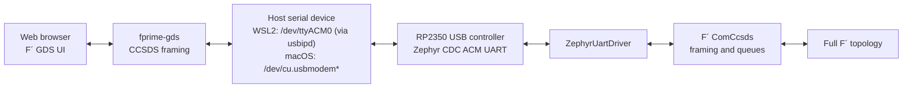
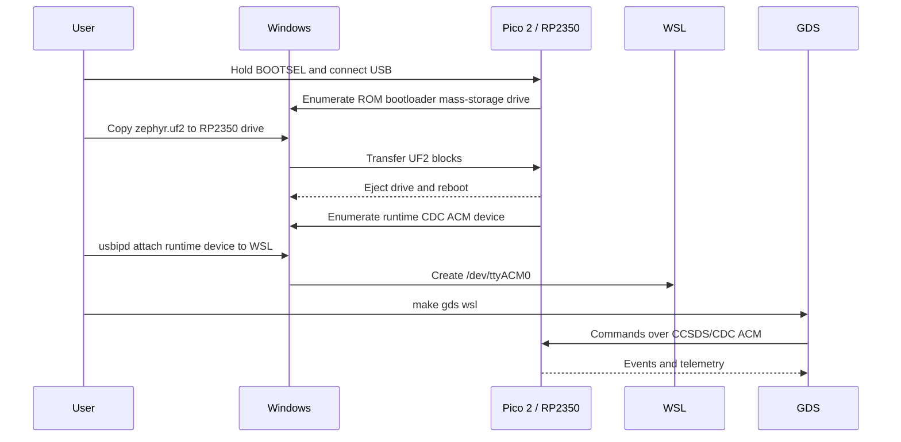
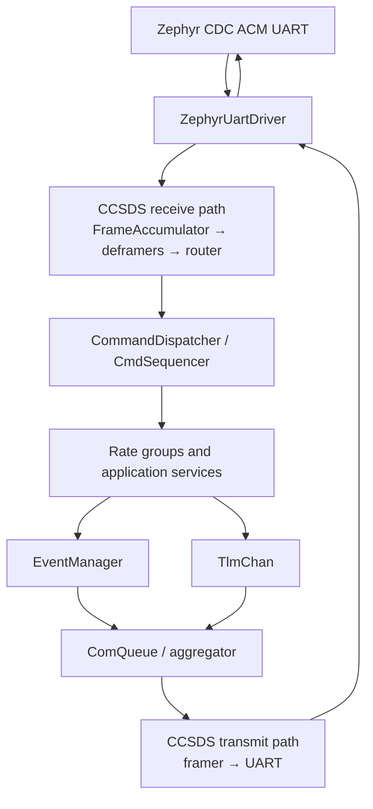

# FprimeBilleeRcm F´ on RP2350

This deployment runs the complete F´ CDH, CCSDS communications, data-product,
file-handling, sequencing, health, telemetry, and rate-group topology — plus
this project's own rover-specific components (subsystem power control, MCP9808
thermal sensing, INA780B power monitoring, and software fault protection) — on
a stock Raspberry Pi Pico 2 (`rpi_pico2/rp2350a/m33`). Communications use USB
CDC ACM, so the same USB connector used for BOOTSEL becomes a serial device
after the firmware starts.

Hardware-verified end-to-end (build, flash, GDS connection, live telemetry) on
**macOS**. The build system and this guide also support **WSL2/Windows**, the
platform this project was originally designed around, though that path has
not been re-verified against the current source since macOS support was
added.

| Field | Value |
| --- | --- |
| Target board | Stock Raspberry Pi Pico 2 |
| SoC/core target | `rpi_pico2/rp2350a/m33` |
| F´ | `v4.2.2` |
| fprime-zephyr | `8ef1f4e62c6ee4f04598fdb25ceb82b645687af5` |
| Zephyr | `v4.3.0` |
| Zephyr SDK | `0.17.4`, ARM toolchain |
| Firmware transport | USB CDC ACM carrying F´ CCSDS frames |

This README covers building, flashing, and running the firmware, plus a
developer reference for working with fprime-zephyr on this target. For
**operating** the rover once it's running — sending commands, reading
telemetry, understanding E-STOP and fault-protection behavior — see
[`docs/OPERATOR_MANUAL.md`](docs/OPERATOR_MANUAL.md).

---

# How To Use

## Quick start

```bash
make setup           # create the Python venv
make setup-zephyr    # fetch Zephyr + SDK (slow, one-time)
make build-rp2350     # build build-artifacts/zephyr.uf2
```

Then flash and connect using whichever platform section below matches your
host: [macOS](#flash-and-run--macos) or [WSL2/Windows](#flash-and-run--wsl2windows).

## Setup

### Hardware and host software

**Hardware:**

- Raspberry Pi Pico 2 with RP2350A;
- known-good USB data cable (some cables are power-only);
- a Mac, a Windows PC with WSL2, or a native Linux PC;
- a direct USB port for initial troubleshooting, avoiding an unpowered hub.

**macOS:** Xcode Command Line Tools (`xcode-select --install`) and Python
3.9+ (Homebrew or [python.org](https://python.org)). No other host software —
the Zephyr SDK and toolchain are fetched into the project's own venv by
`make setup-zephyr`, and the board's CDC-ACM device appears directly as
`/dev/cu.usbmodem*`.

**Windows/WSL2:** current Windows 11, current WSL2, Ubuntu 22.04+, and
[`usbipd-win`](https://github.com/dorssel/usbipd-win) 5.0+:

```powershell
wsl --update
winget install --interactive --exact dorssel.usbipd-win
```

Then, in WSL Ubuntu, the standard Zephyr host dependencies:

```bash
sudo apt-get update
sudo apt-get install --no-install-recommends \
  git cmake ninja-build gperf ccache dfu-util device-tree-compiler wget \
  python3 python3-dev python3-pip python3-setuptools python3-tk \
  python3-venv python3-wheel xz-utils file make gcc gcc-multilib \
  g++-multilib libsdl2-dev libmagic1 usbutils
```

F´ 4.2.2 requires Python 3.9+; the project installs its own CMake 3.26.0
inside the venv, so Ubuntu 22.04's older system CMake doesn't need replacing.

### Clone

```bash
git clone --recurse-submodules <repository-url> fprime-billee-rcm
cd fprime-billee-rcm
git submodule update --init --recursive
git submodule status
```

`lib/fprime` and `lib/fprime-zephyr` are third-party pins — don't
independently update either; this project carries a small compatibility
layer for this exact combination (see
[F´ / fprime-zephyr / Zephyr compatibility layer](#f--fprime-zephyr--zephyr-compatibility-layer)).
`lib/fprime-billee` is this project's own component library
(`Billee.SubsystemManager`, `Billee.McpManager`, `Billee.InaManager`,
`Billee.FPManager`, and their supporting types/state machines) and lives on
its own `lucadev` branch, which should stay in sync with the outer repo's
`lucadev` branch.

### Python environment

```bash
make setup                     # or: make setup PYTHON=python3.12
./fprime-venv/bin/python --version
./fprime-venv/bin/cmake --version        # must be >= 3.24.2
./fprime-venv/bin/fprime-util version-check
```

### Zephyr toolchain

```bash
make zephyr-setup
```

This installs West in the project venv, runs `west update` against the
pinned `west.yml`, installs Zephyr's Python packages, and installs the
`arm-zephyr-eabi` SDK toolchain (validated at 0.17.4). Requires internet
access; the downloads are substantial.

```bash
./fprime-venv/bin/west topdir      # must print the project root
./fprime-venv/bin/west sdk list    # must show an installed ARM toolchain
test -f lib/zephyr-workspace/zephyr/zephyr-env.sh
```

## Build

```bash
make build-rp2350
```

This removes the previous Zephyr build, regenerates for
`rpi_pico2/rp2350a/m33`, builds, and installs artifacts — a clean generation
every time, since stale devicetree or FPP output can otherwise hide
configuration changes. Successful output ends with a memory-usage summary and
`Converted to uf2` / `make build-rp2350 complete`.

```bash
test -f build-artifacts/zephyr.uf2
test -f build-artifacts/zephyr.elf
test -f build-artifacts/zephyr.map
test -f build-artifacts/zephyr/fprime-zephyr-deployment/dict/rp2350DeploymentTopologyDictionary.json
```

If you changed any config (`prj.conf`, an FPP override, `instances.fpp`,
etc.), validate it before flashing — see
[Configuration invariants](#configuration-invariants).

## Flash and run — macOS

1. Hold **BOOTSEL** while plugging the Pico 2 into your Mac (or while
   pressing its reset button, if the board has one wired).
2. It mounts as an `RP2350` (or `RPI-RP2`) mass-storage volume. Copy the UF2
   over, or let Make do it once you know the volume path:
   ```bash
   make cpfirm mac                          # copies to $MAC_BOOTSEL_VOLUME
   MAC_BOOTSEL_VOLUME=/Volumes/RP2350 make cpfirm mac   # override if it mounts elsewhere
   ```
3. The board reboots automatically once the copy finishes and re-enumerates
   as a USB CDC-ACM serial device, typically `/dev/cu.usbmodem2101`:
   ```bash
   ls -la /dev/cu.usbmodem*
   ```
4. Start GDS:
   ```bash
   make gds mac                             # uses $MAC_UART_DEVICE, default /dev/tty.usbmodem2101
   ```
   Open the printed URL (normally `http://127.0.0.1:5000`) and check the
   Events/Channels tabs for live data.

If `make gds mac` shows no traffic even though the port exists, see
[GDS connects but shows no traffic (macOS)](#gds-connects-but-shows-no-traffic-macos)
before assuming the firmware is broken — a stuck background `fprime-gds`
process silently holding the port is a common cause.

## Flash and run — WSL2/Windows

1. Unplug the Pico 2.
2. Hold BOOTSEL while plugging it into Windows.
3. Copy `build-artifacts/zephyr.uf2` to the `RP2350` mass-storage drive (via
   `\\wsl$\<distribution>\<path>` if dragging from a Windows app).
4. Wait for the drive to eject itself and the board to reboot.

BOOTSEL mode is only the bootloader and does not expose the F´ serial
connection. After reboot, Windows should show a new **USB Serial Device
(COMx)**. The runtime firmware identifies as USB `2FE3:0004`; `2E8A:000F` is
the separate RP2350 BOOTSEL device — do not confuse the two when picking a
COM port.

```powershell
[System.IO.Ports.SerialPort]::GetPortNames()
Get-PnpDevice -Class Ports | Format-Table Status,FriendlyName,InstanceId
```

Windows owns USB devices by default. Install `usbipd-win`, then, after the
flashed board has rebooted, identify and attach the **USB Serial Device**:

```powershell
usbipd list
usbipd bind --busid <BUSID>       # Administrator PowerShell
usbipd attach --wsl --busid <BUSID>
```

Keep WSL open while attaching. In WSL, verify and start GDS:

```bash
ls -l /dev/ttyACM*
make gds wsl
```

If the device isn't `/dev/ttyACM0`: `UART_DEVICE=/dev/ttyACM1 make gds`.

While attached to WSL, the device is unavailable to Windows applications. To
return it: `usbipd detach --busid <BUSID>` in PowerShell.

See [Troubleshooting](#troubleshooting) below, and
[F´ / fprime-zephyr / Zephyr compatibility layer](#f--fprime-zephyr--zephyr-compatibility-layer)
for the compatibility-layer details.

## Flash and run — Linux (Jetson / native)

On the Jetson there is no desktop auto-mounter, and Ubuntu 24.04's
`chromium-browser`-style snap situation also affects `picotool` (not in apt).
`make cpfirm` handles all of it:

1. One-time: `make setup-picotool` — installs `picotool` from apt, or builds it
   from source into `build-tools/` if apt has no package (it doesn't on L4T),
   plus a udev rule so it runs without `sudo`.
2. Put the board in BOOTSEL:
   - hold **BOOTSEL**, tap RESET / replug USB, release; **or**
   - `make bootsel` (reboots a *running* board into BOOTSEL via picotool — needs
     firmware support; the button always works).
3. Flash:
   ```bash
   make cpfirm
   ```
   `cpfirm` tries, in order: a mounted `RP2350`/`RPI-RP2` volume
   (`$LINUX_BOOTSEL_VOLUME`); an unmounted `RP2350`-labelled block device, which
   it `sudo mount`s, copies to, and unmounts; then `picotool load -x -f`. It
   errors clearly if the board is still running firmware (`/dev/ttyACM0`
   present) rather than in BOOTSEL.
4. The board reboots into the new firmware as `/dev/ttyACM0`. Start GDS with
   `make gds` (add `UART_DEVICE=/dev/ttyACM1` if it enumerates elsewhere), or
   run it as an always-on service — see
   [Run GDS as a service](#run-gds-as-a-service-headless-jetson).

## Start GDS

Covered inline above for each platform (`make gds mac` / `make gds wsl` /
`make gds` on native Linux). The launcher (`uart_gds.sh`) verifies the venv
has `fprime-gds`, the generated dictionary exists, and the serial device is a
character device, then starts GDS with no local deployment executable, the
generated dictionary, UART communication, and `space-packet-space-data-link`
CCSDS framing.

`lan_uart_gds.sh` is the same launcher but binds the web UI to `0.0.0.0` (LAN
access), for a headless Jetson you reach from another machine.

## Run GDS as a service (headless Jetson)

`make install-gds-service` installs a systemd service that runs
`lan_uart_gds.sh` at every boot inside a **detached `screen` session**, so the
GDS comes up unattended and you can attach to it live over SSH.

```bash
make install-gds-service     # sudo; run from your normal account (needs $SUDO_USER)
```

What it does ([`install-lan-gds-service.sh`](install-lan-gds-service.sh)):

- `apt-get install screen` if it isn't already present.
- Writes `/etc/systemd/system/billee-lan-gds.service`, running
  `screen -DmS billee-lan-gds gds-run-loop.sh` as your user, in the `dialout`
  group, after `network-online.target`, then `systemctl enable --now`.
- [`gds-run-loop.sh`](gds-run-loop.sh) runs `lan_uart_gds.sh` in a loop: on any
  exit — board unplugged, missing build, crash — it waits **10 s**
  (`GDS_RETRY_SECONDS`) and starts it again. `Restart=always` /
  `RestartSec=10` in the unit is a backstop if `screen` itself dies.

Managing it:

| Command | Purpose |
| --- | --- |
| `make gds-attach` | Attach to the live `screen` session (`Ctrl-A` then `D` to detach) |
| `make gds-service-status` | `systemctl status` + recent `journalctl` lines |
| `sudo systemctl stop billee-lan-gds` | Stop it (stays enabled for next boot) |
| `make uninstall-gds-service` | Disable and remove the unit |

Run `screen -r billee-lan-gds` as the same user the service runs as.

## Operating the rover

Once GDS is connected and showing live telemetry, see
**[`docs/OPERATOR_MANUAL.md`](docs/OPERATOR_MANUAL.md)** for the full command
reference: subsystem power control, E-STOP behavior, thermal/power
telemetry, and the FPManager fault-protection state machine.

## Acceptance checklist

- [ ] `make build-rp2350` exits successfully.
- [ ] Static linked RAM leaves headroom (see [Runtime heap management](#runtime-heap-management) — this is *not* the same thing as heap headroom).
- [ ] UF2 inspection reports family `0xe48bff57` (see [Build validation](#build) checks).
- [ ] The BOOTSEL drive ejects after copying the UF2.
- [ ] The runtime USB identity (`2FE3:0004` / `/dev/cu.usbmodem*`) appears after reboot.
- [ ] GDS connects and displays events or telemetry from the board.
- [ ] A safe command (`cmdDisp.CMD_NO_OP`) sent from GDS receives a command response.

Compilation alone does not prove the runtime conditions — verify all of them
on real hardware before calling a change done.

---

# Reference: System Architecture and Developer Guide

## System architecture

### Runtime communication path



USB CDC is a byte stream. The baud-rate value is retained for the UART API
and GDS configuration, but USB does not transmit bits at a physical
115200-baud UART clock.

The entry point sleeps for a flat 3 seconds before constructing the F´
topology, to let the USB CDC-ACM class finish enumerating before anything
tries to write to it — writes attempted too early are silently dropped, not
queued.

### Flash and runtime USB states

This is the WSL2/Windows flow specifically, since it has an extra hop
(`usbipd`) that macOS doesn't need — on macOS, step 4 is simply "the board
re-enumerates as `/dev/cu.usbmodem*` directly usable by GDS."



### Firmware composition

The deployment uses Zephyr-native time, rate, task, file, mutex, queue, raw
time, console, and UART implementations. The principal data flow:



This project's own components sit alongside the reference topology, driven
by the same rate groups: `SubsystemManager` (drivetrain/arm/science power
enables + E-STOP input), `McpManager` (3× MCP9808 thermal sensors over I2C1),
`InaManager` (9× INA780B power monitors over I2C0), and `FPManager` (software
fault protection, consuming readings pushed in by the two sensor managers).

## Working with fprime-zephyr

This section is the developer reference for building on top of this
deployment: what's true about this platform, what to keep in sync when
adding a component, and how to reason about (and measure) RAM/heap margin.
Read it top to bottom before adding a new active component.

### Platform facts

- **USB console routing.** `boards/rpi_pico2_rp2350a_m33.overlay` creates a
  `zephyr,cdc-acm-uart` node under `zephyr_udc0` and selects it as
  `zephyr,console`, which is what `ZephyrUartDriver` opens via
  `DT_CHOSEN(zephyr_console)`. The built devicetree must keep showing
  `zephyr,console = &cdc_acm_uart0`; if it reverts to `uart0`, runtime
  communication moves to GPIO 0/1 and the USB COM port disappears. Check
  with `grep -nE 'zephyr,console|cdc_acm_uart0' build-artifacts/zephyr.dts`.
- **Active-task pool must match exactly.** `CONFIG_DYNAMIC_THREAD_POOL_SIZE`
  in `prj.conf` must equal the number of active/queued F´ components exactly
  — not merely `>=`. This isn't a "headroom is free" setting: every slot
  costs a full `CONFIG_DYNAMIC_THREAD_STACK_SIZE` of static RAM whether or
  not a task ever uses it, and that RAM competes directly with the runtime
  heap (see [Runtime heap management](#runtime-heap-management)). Count the
  actual `.start()` calls in the generated
  `rp2350DeploymentTopologyAc.cpp::startTasks()` after any topology change
  rather than guessing.
- **Every active-component stack size must equal
  `CONFIG_DYNAMIC_THREAD_STACK_SIZE` exactly.** This project's
  `Default.STACK_SIZE` (`rp2350Deployment/Top/instances.fpp`) isn't the only
  place stack size is set — `config/rp2350-overrides/CdhCoreConfig.fpp`
  independently pins `cmdDisp`/`events`/`tlmSend`'s stacks, so those three
  need updating too if the value ever changes. A mismatch asserts
  `Os::Task::Status::ERROR_RESOURCES` partway through `startTasks()`. Both
  values are currently 8192 bytes (Zephyr's main thread stack is a separate,
  independent 8192-byte setting, not part of this constraint).
- **Desktop-sized capacities don't fit RP2350 RAM.** F´'s reference defaults
  (hundreds of full communication buffers, a 127-file data-product catalog,
  a 500-bucket telemetry database, etc.) target much larger systems.
  `config/rp2350-overrides/*` and this project's own `FprimeBilleeRcm/Config/*`
  resize the same services for an embedded target without removing any
  topology or service — see
  [Current tuned values](#current-tuned-values-reference) for the specifics.
  If the topology grows, recalculate these; they're capacity limits, not
  feature exclusions.

### F´ / fprime-zephyr / Zephyr compatibility layer

F´ `v4.2.2` and this revision of `fprime-zephyr` come from different points
in F´'s development and aren't fully compatible out of the box. This project
carries a small, self-contained compatibility layer rather than patching
either submodule directly:

- **Load Zephyr before F´.** The top-level `CMakeLists.txt` initializes
  Zephyr (`find_package(Zephyr ...)`) before calling `project()`, so Zephyr
  can select the board, SDK, compiler, device tree, and application target
  before F´ configures the deployment.
- **Attach the deployment to Zephyr's `app` target.** Without
  `add_fprime_subdirectory(...)` for `FprimeBilleeRcm` and `rp2350Deployment`,
  Zephyr's `app` target never receives `Main.cpp` or the topology
  (`No SOURCES given to target: app`).
- **Project-local deployment registration.** The pinned `fprime-zephyr`
  revision expects an installation helper
  (`lib/fprime/cmake/target/fprime_install.cmake`) and an
  `Os_CountingSemaphore_Stub` target, neither of which exists in F´ 4.2.2.
  `cmake/register_fprime_zephyr_4_2_2_deployment.cmake` supplies both: it
  mirrors `fprime-zephyr`'s registration behavior and runs the generated
  installer directly, and defines an empty `Os_CountingSemaphore_Stub`
  interface target (safe here because this deployment never uses the
  counting-semaphore interface). If a future F´ upgrade adds real support
  for either, remove the corresponding shim.
- **Zephyr task-handle size.** F´ 4.2.2 defaults `FW_TASK_HANDLE_MAX_SIZE`
  to 40 bytes; Zephyr 4.3's `Os::Zephyr::Task::ZephyrTask` is 168 bytes,
  which fails `static_assert` against that default.
  `FprimeBilleeRcm/Config/PlatformCfg.fpp` overrides it to 192 bytes (with
  alignment headroom).
- **Linux-only components replaced with Zephyr equivalents:**

  | Linux component | Zephyr component |
  | --- | --- |
  | `Svc.LinuxTimer` | `Zephyr.ZephyrRateDriver` |
  | `Drv.LinuxUartDriver` | `Zephyr.ZephyrUartDriver` |
  | `Svc.ChronoTime` | `Zephyr.ZephyrTime` |

  `Svc.ChronoTime` specifically can't be used here — its standard-library
  clock path needs `gettimeofday`, which this Zephyr configuration doesn't
  provide.
- **UART setup.** `Zephyr::ZephyrUartDriver` has no dedicated POSIX receive
  thread (unlike `Drv::LinuxUartDriver`) — its `schedIn` port must be driven
  periodically by a rate group (`rateGroup1.RateGroupMemberOut[5] ->
  comDriver.schedIn`).
- **Rate driver.** `Zephyr::ZephyrRateDriver` wraps a Zephyr kernel timer,
  configured in milliseconds, started once, then cycled continuously in
  `startRateGroups()` — this loop runs for the firmware's lifetime; there's
  no desktop-style Ctrl-C teardown path.
- **Config filename.** The Kconfig file must be named `prj.conf` — Zephyr
  auto-detects that name specifically; `proj.conf` is not recognized.

### Configuration invariants

Maintain these whenever adding components or changing capacities:

| Invariant | Current value |
| --- | --- |
| `CONFIG_DYNAMIC_THREAD_POOL_SIZE` == active/queued component count | 20 |
| Every active component's FPP stack size == `CONFIG_DYNAMIC_THREAD_STACK_SIZE` | 8192 |
| `TLMCHAN_HASH_BUCKETS` >= actual telemetry channel count (see [note below](#runtime-heap-management)) | 125 buckets, 119 channels |

### Adding a new active component

1. Add its `instance` (queue size, stack size — must equal
   `CONFIG_DYNAMIC_THREAD_STACK_SIZE` — and priority) to `instances.fpp`, and
   add it to the `topology { instance ... }` block and any connections in
   `topology.fpp`.
2. Increment `CONFIG_DYNAMIC_THREAD_POOL_SIZE` in `prj.conf` by exactly 1 per
   new active/queued component. Keep it exactly matched to the generated
   active-stack count — both under- and over-provisioning cost real
   correctness or RAM for no benefit.
3. If it needs a peripheral (I2C/SPI/etc.), enable the Kconfig
   (`CONFIG_I2C=y`, etc.).
4. If it declares an `async input port`, decide its overflow policy
   explicitly (`assert`/`drop`/`block`/`hook`) rather than taking the
   default. The default is `assert` — a burst that outruns the queue depth
   crashes the whole component (and anything downstream health-pinging on
   it) rather than degrading gracefully. For ports that only carry the
   latest-value-wins kind of data (sensor readings, periodic status), `drop`
   is almost always the right choice; size the queue to comfortably hold a
   normal burst so `drop` is a backstop, not a routine occurrence.
5. If it adds telemetry channels, recheck `TLMCHAN_HASH_BUCKETS` against the
   new total channel count (see below) — this asserts the moment a channel
   *beyond* the configured count is first written to, not at build time.
6. Rebuild (`make build-rp2350`), flash, and **measure on real hardware**,
   not just from a clean build log: run the heap probe below through a full
   boot, and do an **extended** live test (a minute or more of continuous
   telemetry/events over GDS), since a queue or heap margin problem can look
   like a clean boot and only surface once the new component's rate group
   has ticked several times or a burst of messages arrives.

### Runtime heap management

**The RAM percentage in the linker/build summary is static usage only** —
`.data` + `.bss` + the `CONFIG_DYNAMIC_THREAD_POOL_SIZE` stack pool. It does
not include a single byte of what components allocate from the heap at
runtime. Zephyr's `CONFIG_COMMON_LIBC_MALLOC_ARENA_SIZE=-1` gives the heap
*whatever's left* from the linker's `_end` symbol to the top of SRAM — a
number that isn't printed anywhere in normal build output. A build can
report a low static RAM percentage and still run out of heap partway through
boot. Never infer heap headroom from the static RAM percentage; past the
shared starting pool, the two are unrelated.

(`TLMCHAN_HASH_BUCKETS`, mentioned above, is the one exception worth
flagging here even though it's static, not heap: it's a fixed-size array,
but its nodes are handed out lazily — one per *distinct* channel ID the
first time it's ever written, not one per channel that merely exists in the
dictionary. A hard `FW_ASSERT` fires the moment a write needs a node and the
pool is already full, so undercounting it produces exactly the same kind of
boot-time-then-later crash as a heap-exhaustion bug, just on a different
resource. Keep it at or above the dictionary's actual channel count.)

**Every place heap gets spent at boot, in order** (see `setupTopology()`):

| Phase | What allocates | Formula |
|---|---|---|
| `initComponents()` | Every active/queued component's own async-port message queue | `queue size × largest async message size for that component` |
| `configComponents()` | Every `Svc::ComQueue.configure()` (e.g. `ComCcsds::comQueue`) | its own internal priority-queue storage, sized by that subtopology's `QueueDepths` (`events`/`tlm`/`file`) — **separate from, and easy to confuse with, that same component's `QueueSizes` entry** (its own async-port message queue) |
| `configComponents()` | Every `Svc::BufferManager::setup()` (e.g. `commsBufferManager`, `dpBufferManager`) | `Σ(bufferSize × numBuffers)` per bin, plus small per-buffer overhead |
| `configComponents()` | `Svc::DpCatalog::configure()`, `Svc::DpWriter::configure()`, `Svc::FileDownlink::configure()` | proportional to `DP_MAX_DIRECTORIES` / `DP_MAX_FILES` (`config/rp2350-overrides/DpCatalogCfg.hpp`) and queue depths |
| `configureTopology()` (project code) | Any explicit `allocateBuffer()` call | e.g. `cmdSeq.allocateBuffer(0, mallocator, 5 * 1024)` — a flat, unconditional amount |

Two things that aren't obvious from the table:

- **Every `Svc::ComQueue`-based subtopology has a two-config split**:
  `QueueSizes` is the component's own thread queue; `QueueDepths` is the
  internal storage its `.configure()` call allocates separately. Tuning one
  without checking the other is easy to do and can leave the larger cost
  untouched.
- **A failure late in this table is often caused by something earlier**
  leaving nothing left for it — the assert message names the symptom
  component, not necessarily the actual culprit. When margin runs out,
  measure backward through the table with the probe below rather than
  tuning whichever component's name appears in the assert.

**A larger, static (not heap) cost worth understanding alongside this:**
`Svc::TlmChan` allocates one `TlmEntry` per telemetry hash bucket
(`TLMCHAN_HASH_BUCKETS`, doubled by its own internal double-buffering), and
each `TlmEntry` embeds an `Fw::TlmBuffer` sized by the framework-wide
`FW_COM_BUFFER_MAX_SIZE` — the same constant that sizes every command,
event, param, and file buffer
(`lib/fprime/default/config/FpConstants.fpp`) — regardless of how small this
project's actual telemetry types are (the largest, `Billee::ThermalReading`,
is ~42 bytes). At the framework default of 512, each bucket costs roughly
1 KiB of static RAM no matter how small the payload actually is; at scale
(100+ channels) that dwarfs any one queue-depth setting. This project
overrides `FW_COM_BUFFER_MAX_SIZE` down to 160
(`FprimeBilleeRcm/Config/FpConstants.fpp`, project-level override, no
changes to `/lib`), which cuts each bucket's cost roughly in proportion.
Two dependent constants moved with it:

- **`FW_FILE_CHUNK_SIZE`** (`FprimeBilleeRcm/Config/PlatformCfg.fpp`), since
  `FW_FILE_BUFFER_MAX_SIZE` equals `FW_COM_BUFFER_MAX_SIZE` exactly (no
  subtraction) — file downlink chunks must still fit whole inside it.
  Smaller chunks mean more of them per file transfer, not broken transfers.
- **`FW_LOG_STRING_MAX_SIZE`** (same `FpConstants.fpp` override) — a
  `static_assert` in `Fw/FPrimeBasicTypes.hpp` requires this stay below
  `FW_LOG_BUFFER_MAX_SIZE`, which derives from `FW_COM_BUFFER_MAX_SIZE`. It
  only affects truncation length of file paths in `FW_ASSERT` failure
  reports, not normal event data.

**Overriding a framework-defined FPP constant:** the override file's name
must match whichever framework file originally declared the constant — F´'s
config-override locator maps by filename, not by constant name, and the
error if this is wrong (`inconsistent location path`) doesn't spell out the
fix directly. The override also **replaces the named file entirely** rather
than patching it: it must contain a full copy of every constant the
framework's original file declares, not just the ones being changed, or
later constants reference an undefined symbol.

#### The heap probe

A direct, on-hardware measurement of "how much heap is actually left right
now" — the largest single block currently allocatable — since nothing in
the static build output can tell you that.

```cpp
#include <zephyr/sys/printk.h>
#include <cstdlib>

void heapProbe(const char* label) {
    size_t lo = 0, hi = 256 * 1024, best = 0;
    while (lo <= hi) {
        size_t mid = lo + (hi - lo) / 2;
        void* p = std::malloc(mid);
        if (p != nullptr) {
            std::free(p);
            best = mid;
            lo = mid + 1;
        } else {
            if (mid == 0) break;
            hi = mid - 1;
        }
    }
    printk("HEAPPROBE[%s]: largest allocatable block = %u bytes\n", label, (unsigned)best);
}
```

How to use it:

1. Add the function above to `rp2350Deployment/Top/rp2350DeploymentTopology.cpp`
   (a project-owned file, safe to edit directly), and call
   `heapProbe("some label")` between each phase of `setupTopology()`
   (`initComponents`, `setBaseIds`, `connectComponents`, `regCommands`,
   `configComponents`, `configureTopology`, `loadParameters`, `startTasks`).
2. For finer resolution *inside* `configComponents()` or `regCommands()`
   (autocoded, in
   `build-fprime-automatic-zephyr/rp2350Deployment/Top/rp2350DeploymentTopologyAc.cpp`),
   forward-declare `void heapProbe(const char*);` at the top of that
   generated file and add calls between each component's
   `.configure()`/`.setup()`/`.regCommands()` line. This file is regenerated
   by `fprime-util generate`, so after editing it **build incrementally** —
   `fprime-venv/bin/fprime-util build zephyr` (not the full
   `make build-rp2350`, which force-regenerates and discards the hand-edit).
3. Flash and capture serial output (see
   [Host tooling notes](#host-tooling-notes-macoswsl) for a reliable capture
   method). Read the `HEAPPROBE[...]` lines in order: the phase where the
   number drops sharply, or hits single-to-low-triple digits, is where to
   look for the actual consumer — not wherever the eventual assert fires.
4. **Remove all probe calls and the forward declaration before committing.**
   They're diagnostic-only; leaving them in adds `printk` traffic on the
   same UART as the CCSDS binary stream and will corrupt telemetry.

#### Current tuned values (reference)

| Setting | Location | Current value |
|---|---|---|
| `FW_COM_BUFFER_MAX_SIZE` | `FprimeBilleeRcm/Config/FpConstants.fpp` | 160 (framework default 512) |
| `FW_FILE_CHUNK_SIZE` | `FprimeBilleeRcm/Config/PlatformCfg.fpp` | 128 (framework default 512) |
| `FW_LOG_STRING_MAX_SIZE` | `FprimeBilleeRcm/Config/FpConstants.fpp` | 100 (framework default 200) |
| `TLMCHAN_HASH_BUCKETS` | `FprimeBilleeRcm/Config/TlmChanImplCfg.hpp` | 125 (must be ≥ generated channel count; currently 119) |
| `CdhCoreConfig.QueueSizes.$health` | `config/rp2350-overrides/CdhCoreConfig.fpp` | 16 (framework default 32) |
| `CdhCoreConfig.QueueSizes.tlmSend` | `config/rp2350-overrides/CdhCoreConfig.fpp` | 16 (framework default 32) |
| `ComCcsdsConfig.QueueSizes.comQueue` | `config/rp2350-overrides/ComCcsdsConfig.fpp` | 16 (framework default 24) |
| `ComCcsdsConfig.QueueDepths.{events,tlm,file}` | `config/rp2350-overrides/ComCcsdsConfig.fpp` | 4 / 8 / 4 (framework default 16 / 32 / 4) |
| `CONFIG_DYNAMIC_THREAD_POOL_SIZE` | `prj.conf` | 20 (one per active component) |
| `CONFIG_DYNAMIC_THREAD_STACK_SIZE` | `prj.conf` | 8192 (must match every active-component stack size) |
| `cmdSeq` sequence buffer | `rp2350Deployment/Top/rp2350DeploymentTopology.cpp` (`configureTopology()`) | 5 KiB, flat |
| `FPManager`'s `powerReadingIn`/`thermalReadingIn` queue | `rp2350Deployment/Top/instances.fpp` | 16, `drop` overflow policy |

Keep significant static headroom and re-measure on hardware (don't just
rebuild and assume) after changing any of: active task count or stack size;
component queue depths (both `QueueSizes` and any `QueueDepths`-style
internal config on a `Svc::ComQueue`); event/telemetry/file packet depths
(these all share `FW_COM_BUFFER_MAX_SIZE`'s bucket sizing, so one unusually
large new type raises the cost of every bucket, not just its own);
communication/data-product buffer counts or sizes; sequence limits;
parameter entries; data-product catalog size.

### Project configuration files

| File | Purpose |
| --- | --- |
| `Makefile` | Setup, build, flash (`cpfirm` — mac/wsl/Linux auto-mount/picotool), `bootsel`, `setup-picotool`, GDS (`gds mac`/`wsl`), and the `install-gds-service` systemd entry points |
| `prj.conf` | Zephyr threads, heap, C++, USB CDC ACM, I2C, and device configuration |
| `boards/rpi_pico2_rp2350a_m33.overlay` | Routes the chosen console to USB CDC ACM; subsystem power-enable and E-STOP GPIO pins; I2C0/I2C1 pin remap |
| `CMakeLists.txt` | Loads Zephyr, F´, compatibility code, configuration, and deployment |
| `config/rp2350-overrides/CdhCoreConfig.fpp` | CDH queue depths/stacks |
| `config/rp2350-overrides/ComCcsdsConfig.fpp` | CCSDS queue depths/stacks/buffer sizes |
| `config/rp2350-overrides/DataProductsConfig.fpp`, `FileHandlingConfig.fpp` | Data-product and file-handling capacities |
| `config/rp2350-overrides/DpCatalogCfg.hpp`, `PrmDbImplCfg.hpp`, `FpySequencerCfg.fpp` | Catalog, parameter, and sequencer capacities |
| `FprimeBilleeRcm/Config/PlatformCfg.fpp` | Zephyr 4.3 OSAL object storage sizes; `FW_FILE_CHUNK_SIZE` |
| `FprimeBilleeRcm/Config/FpConstants.fpp` | `FW_COM_BUFFER_MAX_SIZE`, `FW_LOG_STRING_MAX_SIZE`, and the rest of the framework's buffer-sizing constants |
| `FprimeBilleeRcm/Config/TlmChanImplCfg.hpp` | Telemetry database sizing |
| `lib/fprime-billee` | Project component library (`SubsystemManager`, `McpManager`, `InaManager`, `FPManager`, and their `Types`/`StateMachines`), own `lucadev` branch |
| `rp2350Deployment/Main.cpp` | Embedded entry point |
| `rp2350Deployment/Top/instances.fpp` | Project instances, queues, stacks, and priorities |
| `rp2350Deployment/Top/topology.fpp` | Instance list and port connections |
| `rp2350Deployment/Top/rp2350DeploymentTopology.cpp` | Zephyr device configuration and topology startup |
| `uart_gds.sh` | CCSDS-over-UART GDS launcher (used by `make gds`) |
| `lan_uart_gds.sh` | Same launcher, web UI bound to `0.0.0.0` for LAN access |
| `gds-run-loop.sh` | Runs `lan_uart_gds.sh` forever, retrying 10s after any exit |
| `install-lan-gds-service.sh` | Installs `screen` + the `billee-lan-gds` systemd service (`make install-gds-service`) |
| `west.yml` | Pinned Zephyr and required modules |
| `settings.ini` | F´ framework and library locations |

### USB console

The built devicetree must continue to show
`zephyr,console = &cdc_acm_uart0`. If it changes back to `uart0`, runtime
communication moves to GPIO 0/1 and the USB COM port will disappear.

## Host tooling notes (macOS/WSL)

Host-side behaviors worth knowing about, since they can look exactly like a
firmware problem:

- **Raw `cat`/`stty` captures are not reliable on macOS.** This firmware's
  boot path doesn't depend on the CDC-ACM DTR line, but something about how
  macOS's native CDC-ACM driver handles a bare `open()` without asserting it
  is. A small `pyserial` script that explicitly sets `port.dtr = True` on
  open reliably captures boot output when raw `cat` doesn't. Use `pyserial`
  (`serial.Serial(device, baud); port.dtr = True; port.read(...)`) for
  manual inspection, not `cat`/`dd`/`stty`.
- **A stale process can silently hold the port.** A backgrounded
  `fprime-gds` (or its `comm`/`CustomDataHandlers` sub-processes) that
  wasn't fully killed keeps `/dev/cu.usbmodem*` open indefinitely, and a
  *second* `fprime-gds` session starts up cleanly against the same
  dictionary without reporting a conflict — it just never receives
  anything. Check `ps aux | grep fprime_gds` before assuming the firmware
  is broken.
- **`/dev/cu.*` vs `/dev/tty.*`.** Both refer to the same underlying USB CDC
  device, but `/dev/cu.*` ("callout") is correct for a program actively
  opening the connection; `/dev/tty.*` is dial-in-oriented and can behave
  differently. This project's `MAC_UART_DEVICE` default and `uart_gds.sh`
  both use `/dev/tty.usbmodem2101` and this works in practice, but try
  `/dev/cu.*` if a capture behaves strangely.
- **A piped build command can hide a failed build.**
  `some-build-command | tee log | tail -60` reports the exit status of
  `tail` (always 0), not the build — a real link failure partway through
  can go unnoticed while a *stale* `.uf2` from an earlier successful build
  keeps getting reflashed and tested. Check exit codes explicitly
  (`cmd; echo $?`, or redirect to a log file and check `$?` directly)
  rather than trusting a piped command's own exit status.
- **A boot-time, edge-triggered event is easy to miss.** Several events in
  this project (e.g. `McpReadFailure`, `InaReadFailure`,
  `SubsystemFaultShutdown`) intentionally fire once, at most a few seconds
  after boot, rather than repeating every cycle. If GDS attaches even a
  moment after that window, the event is gone even though telemetry
  (which isn't timing-sensitive) still shows the resulting state. To catch
  one of these live, start GDS (or your capture) **before** triggering the
  reboot/reset, not after.

## Troubleshooting


### BOOTSEL drive does not appear

Replace the cable with a verified data cable; avoid hubs and front-panel
ports; hold BOOTSEL before inserting USB; try another port; check Device
Manager for an unknown/failed USB device; try another computer. This is
below the F´/Zephyr layer — firmware isn't running in BOOTSEL mode.

### UF2 copies, but the board remains in BOOTSEL

Rebuild with `make build-rp2350`; confirm RP2350 family `0xe48bff57`; confirm
the copied file is `build-artifacts/zephyr.uf2`, not some other image; wait
for the volume to eject before unplugging; reconnect without touching
BOOTSEL.

### Runtime device appears, but there is no Windows COM port

If the device identity is `2E8A:000F`, it's still BOOTSEL. If `2FE3:0004`
appears under another Device Manager class, remove that device, unplug, and
reconnect so Windows reloads its CDC class driver. Don't use Zadig to
replace the runtime CDC ACM driver with WinUSB — it should use the Windows
USB serial class driver.

### COM exists in Windows but not in WSL

Normal before USB/IP attachment:

```powershell
usbipd list
usbipd bind --busid <BUSID>
usbipd attach --wsl --busid <BUSID>
```

Then in WSL: `lsusb`, `dmesg | tail -50`, `ls -l /dev/ttyACM*`. Confirm the
BUSID belongs to `2FE3:0004`, not the BOOTSEL device.

### GDS reports that `/dev/ttyACM0` is missing

```bash
ls -l /dev/ttyACM*
UART_DEVICE=/dev/ttyACM1 make gds wsl   # if a different node exists
```

If none exists, repeat the USB/IP attachment procedure.

### GDS opens but shows no traffic

1. Close PuTTY, a serial monitor, or any other process using the port.
2. Confirm the dictionary exists and was generated by the same build.
3. Confirm the launcher selects `space-packet-space-data-link` framing.
4. Restart GDS after resetting or reattaching the board.
5. Run with detailed logging: `./uart_gds.sh --log-to-stdout --log-level-gds DEBUG`.
6. Confirm the board didn't return to BOOTSEL and still appears as `2FE3:0004`.

### Build selects `/usr/bin/cmake` 3.22

Build through Make from the repository root (`make build-rp2350`) — the
Makefile prepends `fprime-venv/bin` to `PATH`. If running commands manually,
`source fprime-venv/bin/activate` first and confirm `cmake --version`.

### Build asserts or fails after adding an active component

Count the generated active stack entries and increase
`CONFIG_DYNAMIC_THREAD_POOL_SIZE` to match exactly. Ensure every new stack is
exactly 8192, or change all active stacks and the Zephyr setting together —
see [Configuration invariants](#configuration-invariants).

### Firmware links but resets during initialization

This usually indicates stack or heap pressure:

1. compare current linker RAM usage with a known-good build;
2. inspect the largest BSS symbols in `build-artifacts/zephyr.map`;
3. reduce queue/buffer capacities, or increase them only with measured margin;
4. verify the task pool and exact stack-size invariant;
5. capture a serial log before GDS takes ownership of the port.

Don't solve this by removing arbitrary subtopologies unless the mission
design actually doesn't need them — see
[Runtime heap management](#runtime-heap-management) for the methodology and
reusable heap-probe technique.

### GDS connects but shows no traffic (macOS)

Before suspecting the firmware, check for a stale process silently holding
the port (see [Host tooling notes](#host-tooling-notes-macoswsl)):

```bash
ps aux | grep fprime_gds
```

Kill any leftover `fprime_gds.executables.*` processes (including
`CustomDataHandlers`), then retry. If traffic still doesn't appear: confirm
the port path (`ls -la /dev/cu.usbmodem*`, try `/dev/cu.*` specifically);
confirm the board didn't drop back into BOOTSEL (`/Volumes` shows an
`RP2350`/`RPI-RP2` volume if so); use a `pyserial` script rather than
`cat`/`dd`/`stty` for manual inspection; confirm the flashed `.uf2` is
actually current (see the piped-build-command note above).

## Rebuild checklist after source changes

```bash
git status --short
make build-rp2350
```

Then: check linker memory usage; check generated `.config` thread settings
(`CONFIG_DYNAMIC_THREAD_POOL_SIZE`/`STACK_SIZE`, `CONFIG_MAIN_STACK_SIZE`);
check generated devicetree CDC console selection; check the generated
active-stack count matches `CONFIG_DYNAMIC_THREAD_POOL_SIZE`; check the UF2
family; flash (`make cpfirm mac` / `wsl`, or manual BOOTSEL copy); confirm
the runtime USB device re-enumerates (macOS: `/dev/cu.usbmodem*` — WSL2/
Windows: runtime VID/PID + reattach via `usbipd`); run the GDS event/
telemetry and safe-command test (`make gds mac` / `wsl`).

## References

- [F´ documentation](https://fprime.jpl.nasa.gov/)
- [F´ GDS CLI](https://fprime.jpl.nasa.gov/latest/docs/user-manual/gds/gds-cli/)
- [Zephyr Raspberry Pi Pico 2 board documentation](https://docs.zephyrproject.org/latest/boards/raspberrypi/rpi_pico2/doc/index.html)
- [Zephyr console over USB CDC ACM sample](https://docs.zephyrproject.org/latest/samples/subsys/usb/console/README.html)
- [Zephyr Linux host dependencies](https://docs.zephyrproject.org/latest/develop/getting_started/installation_linux.html)
- [Zephyr West SDK commands](https://docs.zephyrproject.org/latest/develop/west/zephyr-cmds.html)
- [Raspberry Pi Pico-series documentation](https://www.raspberrypi.com/documentation/microcontrollers/pico-series.html)
- [Microsoft: connect USB devices to WSL](https://learn.microsoft.com/en-us/windows/wsl/connect-usb)
- [usbipd-win WSL support](https://github.com/dorssel/usbipd-win/wiki/WSL-support)

## Known limitations

- Hardware-verified on macOS; the WSL2/Windows path hasn't been re-run
  against the current source since macOS support was added, though nothing
  in this deployment is macOS-specific.
- The development VID/PID (`2FE3:0004`) must be replaced before distributing
  a product.
- File APIs are present, but a durable on-board filesystem isn't
  established by this setup.
- 8 KiB active-component stacks are the proven-working value for this
  topology; production stack high-water marks should still be measured
  rather than assumed.
- Capacity values (queue depths, buffer counts, telemetry buckets) must be
  revisited as telemetry, parameters, data products, sequence complexity, or
  active-component count grow — see
  [Configuration invariants](#configuration-invariants) and
  [Runtime heap management](#runtime-heap-management) for how to verify
  margin rather than estimate it.
- `InaManager`'s 9 INA780B sensors and `McpManager`'s 3 MCP9808 sensors are
  read continuously regardless of whether hardware is connected; with
  nothing attached, both correctly report failure (see
  `docs/OPERATOR_MANUAL.md`) rather than silently going stale.
