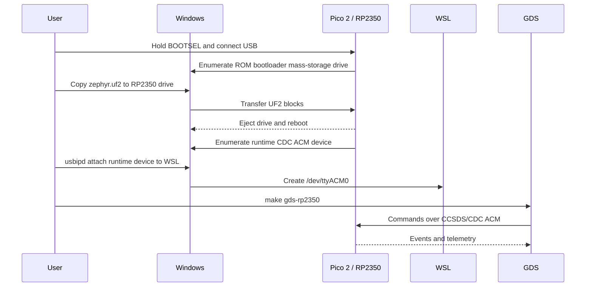
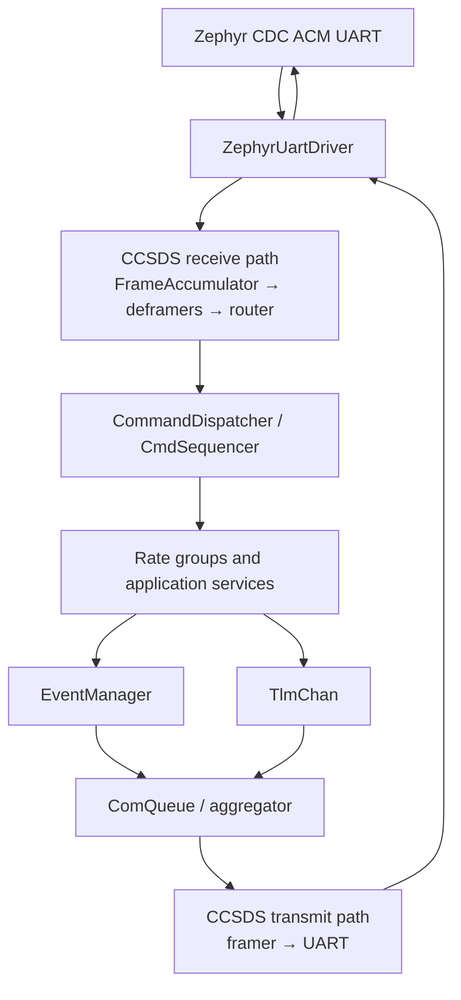
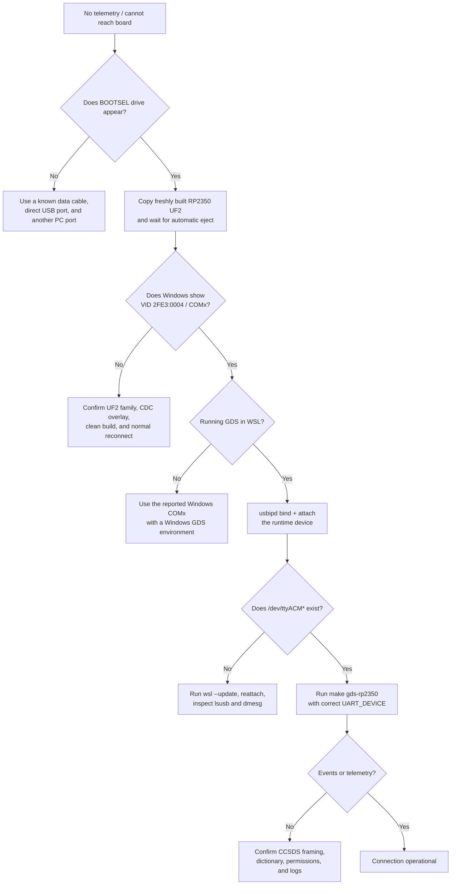

# FprimeBilleeRcm F´ on RP2350

This deployment runs the complete F´ CDH, CCSDS communications, data-product,
file-handling, sequencing, health, telemetry, and rate-group topology on a
stock Raspberry Pi Pico 2 (`rpi_pico2/rp2350a/m33`). Communications use USB
CDC ACM, so the same USB connector used for BOOTSEL becomes a serial device
after the firmware starts.

## Build

From the project root in WSL/Linux:

```bash
make zephyr-rp2350
```

The flashable image is `build-artifacts/zephyr.uf2`. Run `make help` to see all
project commands.

## Flash

1. Unplug the Pico 2.
2. Hold BOOTSEL while plugging it into Windows.
3. Copy `build-artifacts/zephyr.uf2` to the `RP2350` mass-storage drive.
4. Wait for the drive to eject itself and the board to reboot.

BOOTSEL mode is only the bootloader and will not expose the F´ serial
connection. After reboot, Windows should show a new **USB Serial Device
(COMx)**. The development firmware identifies as USB `2FE3:0004`; `2E8A:000F`
is the separate RP2350 BOOTSEL device.

Check Windows PowerShell with:

```powershell
[System.IO.Ports.SerialPort]::GetPortNames()
Get-PnpDevice -Class Ports | Format-Table Status,FriendlyName,InstanceId
```

## Run GDS from WSL2

Windows owns USB devices by default. Install `usbipd-win`, then, after the
flashed board has rebooted, identify and attach the **USB Serial Device**:

```powershell
usbipd list
usbipd bind --busid <BUSID>
usbipd attach --wsl --busid <BUSID>
```

`bind` requires an Administrator PowerShell; `attach` does not. Keep WSL open
while attaching. In WSL, verify the result and start GDS:

```bash
ls -l /dev/ttyACM*
make gds-rp2350
```

If the device is not `/dev/ttyACM0`, select it explicitly:

```bash
UART_DEVICE=/dev/ttyACM1 make gds-rp2350
```

While attached to WSL, the device is unavailable to Windows applications. To
return it to Windows:

```powershell
usbipd detach --busid <BUSID>
```

See the end-user
[RP2350 F´/Zephyr Software Design Description](docs/RP2350_FPRIME_ZEPHYR_SDD.md)
for the complete fresh-machine procedure, architecture, verification gates,
and troubleshooting guide. See
[FPRIME_ZEPHYR_4_2_2.md](FPRIME_ZEPHYR_4_2_2.md) for compatibility-layer
details.


# F´ on RP2350 with Zephyr

## Software Design Description and Reproducible Setup Guide

| Field | Value |
| --- | --- |
| Project | FprimeBilleeRcm |
| Target board | Stock Raspberry Pi Pico 2 |
| SoC/core target | `rpi_pico2/rp2350a/m33` |
| F´ | `v4.2.2` |
| fprime-zephyr | `8ef1f4e62c6ee4f04598fdb25ceb82b645687af5` |
| Zephyr | `v4.3.0` |
| Zephyr SDK | `0.17.4`, ARM toolchain |
| Host validated | Ubuntu 22.04 under WSL2 |
| Firmware transport | USB CDC ACM carrying F´ CCSDS frames |
| Document status | Build-verified; physical-board verification required |

## 1. Purpose

This document describes the design and a repeatable, checkpoint-driven
procedure for building, flashing, and operating the full F´ deployment on a
stock Raspberry Pi Pico 2. It records the changes required to make the
deployment boot within the RP2350's RAM and enumerate as a serial device.

The procedure deliberately distinguishes two USB states:

1. **BOOTSEL mode** is the RP2350 ROM bootloader and exposes a mass-storage
   drive used only to copy the UF2.
2. **Runtime mode** is this Zephyr firmware and exposes a CDC ACM serial
   device used by F´ GDS.

Confusing those states is the most common reason for looking for a COM port
while the board is still in BOOTSEL mode.

## 2. Scope

This guide covers:

- fresh WSL2/Ubuntu host setup;
- project and submodule checkout;
- Python, West, Zephyr module, and SDK installation;
- the RP2350-specific F´ and Zephyr design;
- clean firmware generation and build;
- UF2 validation and BOOTSEL flashing;
- Windows USB/COM inspection;
- passing the runtime USB device into WSL2;
- starting F´ GDS with the correct dictionary and framing;
- acceptance checks and troubleshooting.

This guide does not cover:

- a custom RP2350 PCB or a Pico 2 W;
- SWD debugging;
- production USB VID/PID assignment;
- persistent flash filesystems;
- performance qualification or flight certification.

For a custom board, create a Zephyr board definition that matches its flash,
clock, pin, and USB wiring. Do not assume the Pico 2 board target is correct.

## 3. Design goals and requirements

| ID | Requirement | Implementation |
| --- | --- | --- |
| R-01 | Build for the stock Pico 2 Cortex-M33 target | `BOARD=rpi_pico2/rp2350a/m33` |
| R-02 | Produce an RP2350-compatible UF2 | Zephyr emits family ID `0xe48bff57` |
| R-03 | Expose runtime communications over the board's USB connector | CDC ACM devicetree overlay |
| R-04 | Preserve the complete selected F´ topology | CDH, CCSDS, data products, file handling, sequencing, health, telemetry, and rate groups remain present |
| R-05 | Start every active component | 16-entry dynamic thread pool with matching 8 KiB stacks |
| R-06 | Leave sufficient runtime heap | Embedded queue, buffer, catalog, parameter, sequence, and telemetry capacities |
| R-07 | Use the topology's wire protocol in GDS | `space-packet-space-data-link` framing |
| R-08 | Support GDS from WSL2 | `usbipd-win` attachment plus `/dev/ttyACM*` launcher |

## 4. System architecture

### 4.1 Runtime communication path


USB CDC is a byte stream. The baud-rate value is retained for the UART API and
GDS configuration, but USB does not transmit bits at a physical 115200-baud
UART clock.

The entry point waits for the host to assert the CDC DTR signal before starting
the F´ topology. Opening `/dev/ttyACM0` from GDS releases startup, ensuring the
USB class is ready before startup events and the communications-ready signal
are emitted.

### 4.2 Flash and runtime USB states



### 4.3 Firmware composition

The deployment uses Zephyr-native time, rate, task, file, mutex, queue, raw
time, console, and UART implementations. The principal data flow is:



## 5. Why the stock defaults did not boot

The project originally generated a valid-looking UF2 but contained several
runtime blockers.

### 5.1 No runtime USB serial device

Without a project board overlay, Zephyr selected hardware `uart0` on GPIO 0 and
GPIO 1 as `zephyr,console`. Copying the UF2 therefore did not cause Windows to
discover a runtime COM port on the USB connector.

The file `boards/rpi_pico2_rp2350a_m33.overlay` now:

- creates a `zephyr,cdc-acm-uart` node under `zephyr_udc0`;
- selects that node as `zephyr,console`;
- allows `ZephyrUartDriver` to use the USB device selected by
  `DT_CHOSEN(zephyr_console)`.

### 5.2 Too few task slots

The complete topology starts 16 active-component tasks, while the original
Zephyr configuration provisioned 12 dynamic stacks. Tasks beyond the pool
capacity could not start.

`prj.conf` now sets:

```text
CONFIG_DYNAMIC_THREAD_POOL_SIZE=16
```

### 5.3 Stack-size mismatch

F´ reference subtopologies requested 64 KiB task stacks. Zephyr's dynamic
thread pool was configured for a different fixed stack size. The Zephyr task
allocator requires every dynamically allocated F´ task stack to request the
configured size exactly.

All 16 active components and `CONFIG_DYNAMIC_THREAD_STACK_SIZE` now use 8 KiB.
The Zephyr main thread remains 8 KiB to provide initialization headroom.

### 5.4 Desktop capacities exceeded RP2350 RAM

The Pico 2 has 520 KiB RAM. Default F´ queue and buffer capacities are intended
for larger systems. Notable defaults included hundreds of full communication
buffers, a 127-file data-product catalog, a large sequence dictionary, and a
500-bucket telemetry database.

No topology or service was removed. Instead, `config/rp2350-overrides` sizes
the same services for an embedded deployment:

| Resource | RP2350 capacity |
| --- | ---: |
| Active task stacks | 16 × 8 KiB |
| CDH command queue | 8 |
| CDH event queue | 16 |
| CDH telemetry queue | 32 |
| Communications packet queues | 16 events, 32 telemetry, 4 file |
| Communications buffers | 6 normal + 2 file, 1024 bytes each |
| Data-product buffers | 2 × 1024 bytes |
| Data-product catalog | 16 files in 2 directories |
| Fpy sequence dictionary | 128 statements, 8 arguments |
| Fpy sequence stack | 2048 bytes |
| Parameter database | 8 entries |
| Telemetry database | 96 buckets for the current 89 channels |

These are capacity limits, not feature exclusions. If the topology grows,
recalculate them and maintain the invariants in Section 13.

## 6. Verified baseline

The final clean build was verified with:

```text
FLASH: 404192 B / 4 MB      9.64%
RAM:   391448 B / 520 KB   73.51%
UF2 family: RP2350 (0xe48bff57)
Generated active stacks: 16 × 8192 bytes
USB runtime VID:PID: 2FE3:0004
```

The linker-reported RAM is static usage. The remaining approximately 138 KiB
is needed for F´ queues, buffer pools, catalogs, the sequence buffer, and other
runtime allocations.

The reference UF2 produced during validation had this SHA-256:

```text
c6b905fa9b8fe2e7a80e1bc48cc5a98b7c167e84c132db78a06d9a42abd30120
```

A later source change should produce a different hash; a different hash alone
does not indicate a failure.

## 7. Required equipment and host software

### 7.1 Hardware

- Raspberry Pi Pico 2 with RP2350A;
- known-good USB data cable;
- Windows PC with WSL2, or a native Linux PC;
- a direct USB port for initial troubleshooting, avoiding an unpowered hub.

Some USB cables supply power but have no data wires. Such a cable can power the
board without ever creating a drive or COM port.

### 7.2 Windows and WSL2

Recommended:

- current Windows 11;
- current WSL2;
- Ubuntu 22.04 or newer;
- `usbipd-win` 5.0 or newer.

In Administrator PowerShell:

```powershell
wsl --update
winget install --interactive --exact dorssel.usbipd-win
```

Restart Windows if the installer requests it. Confirm the distribution uses
WSL2:

```powershell
wsl --list --verbose
```

### 7.3 Ubuntu packages

In WSL Ubuntu:

```bash
sudo apt-get update
sudo apt-get install --no-install-recommends \
  git cmake ninja-build gperf ccache dfu-util device-tree-compiler wget \
  python3 python3-dev python3-pip python3-setuptools python3-tk \
  python3-venv python3-wheel xz-utils file make gcc gcc-multilib \
  g++-multilib libsdl2-dev libmagic1 usbutils
```

F´ 4.2.2 requires Python 3.9 or newer. Check it before proceeding:

```bash
python3 --version
```

The project installs CMake 3.26.0 inside its virtual environment, so Ubuntu
22.04's older system CMake does not need to be replaced.

## 8. Fresh project setup

Run all Linux commands from WSL, not PowerShell.

### 8.1 Clone

```bash
git clone --recurse-submodules <repository-url> fprime-billee-rcm
cd fprime-billee-rcm
git submodule update --init --recursive
```

Checkpoint:

```bash
git submodule status
```

Expected pinned revisions:

```text
8a62e455a90b6d4f498c332d45d65a2a819988d8 lib/fprime (v4.2.2)
8ef1f4e62c6ee4f04598fdb25ceb82b645687af5 lib/fprime-zephyr
```

Do not independently update either submodule. The project contains a small
compatibility layer for this exact F´/fprime-zephyr combination.

### 8.2 Create the Python environment

```bash
make setup
```

To choose a specific Python installation:

```bash
make setup PYTHON=python3.12
```

Checkpoint:

```bash
./fprime-venv/bin/python --version
./fprime-venv/bin/cmake --version
./fprime-venv/bin/fprime-util version-check
```

The CMake line must report 3.24.2 or newer; this pinned environment reports
3.26.0.

### 8.3 Fetch Zephyr dependencies and install the toolchain

```bash
make zephyr-setup
```

This performs:

1. installation of West in the project virtual environment;
2. `west update` using the pinned `west.yml`;
3. installation of Zephyr's Python packages;
4. installation of the `arm-zephyr-eabi` Zephyr SDK toolchain.

The downloads are substantial and require internet access.

Checkpoint:

```bash
./fprime-venv/bin/west topdir
./fprime-venv/bin/west sdk list
test -f lib/zephyr-workspace/zephyr/zephyr-env.sh
```

`west topdir` must print the project root, and SDK output must show an installed
ARM toolchain. The validated SDK version is 0.17.4.

## 9. Build procedure

From the repository root:

```bash
make zephyr-rp2350
```

The target removes the previous Zephyr build, regenerates for
`rpi_pico2/rp2350a/m33`, builds, and installs artifacts. A clean generation is
intentional: stale devicetree or FPP output can hide configuration changes.

Successful output ends with memory usage and:

```text
Converted to uf2
make zephyr-rp2350 complete
```

Required artifacts:

```bash
test -f build-artifacts/zephyr.uf2
test -f build-artifacts/zephyr.elf
test -f build-artifacts/zephyr.map
test -f build-artifacts/zephyr/fprime-zephyr-deployment/dict/rp2350DeploymentTopologyDictionary.json
ls -lh build-artifacts/zephyr.uf2
```

### 9.1 Validate the generated configuration

Run these checks before flashing a configuration change:

```bash
grep -E \
  'CONFIG_DYNAMIC_THREAD_(STACK_SIZE|POOL_SIZE)|CONFIG_MAIN_STACK_SIZE' \
  build-fprime-automatic-zephyr/zephyr/.config
```

Expected:

```text
CONFIG_MAIN_STACK_SIZE=8192
CONFIG_DYNAMIC_THREAD_STACK_SIZE=8192
CONFIG_DYNAMIC_THREAD_POOL_SIZE=16
```

Check the USB node and chosen console:

```bash
grep -nE 'zephyr,console|cdc_acm_uart0|zephyr,cdc-acm-uart' \
  build-artifacts/zephyr.dts
```

The chosen console must reference `cdc_acm_uart0`.

Check all generated task stacks:

```bash
grep -n '= 8192' \
  build-fprime-automatic-zephyr/rp2350Deployment/Top/rp2350DeploymentTopologyAc.hpp
```

There must be 16 active-component stack entries.

Check the UF2 family:

```bash
./fprime-venv/bin/python \
  lib/zephyr-workspace/zephyr/scripts/build/uf2conv.py \
  -i build-artifacts/zephyr.uf2
```

Expected:

```text
Family ID is RP2350, hex value is 0xe48bff57
Target Address is 0x10000000
```

## 10. Flash procedure

1. Disconnect the Pico 2.
2. Hold the **BOOTSEL** button.
3. While holding BOOTSEL, connect the USB data cable to Windows.
4. Release BOOTSEL after a mass-storage drive named `RP2350` appears.
5. Copy `build-artifacts/zephyr.uf2` from WSL to the Windows-visible drive.
6. Wait for the copy to finish.
7. The drive should automatically eject and the board should reboot.

The BOOTSEL device has Raspberry Pi USB identity `2E8A:000F`. That identity is
not the runtime F´ serial device and must not be used as the expected GDS port.

If dragging directly from a Windows application, the WSL file is available
through:

```text
\\wsl$\<distribution-name>\<absolute-linux-path>
```

For example, open `\\wsl$\Ubuntu\home\...` in Windows Explorer and navigate to
`build-artifacts`.

## 11. Confirm runtime USB on Windows

After flashing, do not hold BOOTSEL. Unplug and reconnect normally if
necessary.

In PowerShell:

```powershell
[System.IO.Ports.SerialPort]::GetPortNames()
Get-PnpDevice -Class Ports | Format-Table Status,FriendlyName,InstanceId
```

Expected result:

```text
USB Serial Device (COMx)
```

The development firmware uses runtime USB identity `2FE3:0004`. This is
Zephyr's development CDC identity, not a production VID/PID.

To inspect all present matching USB devices:

```powershell
Get-PnpDevice -PresentOnly |
  Where-Object {
    $_.InstanceId -match 'VID_2FE3&PID_0004|VID_2E8A&PID_000F'
  } |
  Format-Table Status,Class,FriendlyName,InstanceId
```

Interpretation:

| Observed device | Meaning |
| --- | --- |
| `VID_2E8A&PID_000F`, mass storage | Board is in BOOTSEL mode |
| `VID_2FE3&PID_0004`, Ports/COM | Runtime firmware and CDC ACM started |
| No device in either state | Cable, connector, hub, USB host, or board-power problem |
| BOOTSEL works but runtime device never appears | UF2/firmware startup or Windows enumeration problem |

## 12. Attach the runtime device to WSL2

WSL2 does not automatically receive Windows USB devices. Keep a WSL terminal
open, then list devices in PowerShell:

```powershell
usbipd list
```

Select the BUSID for the **runtime USB Serial Device**, not `RP2350 Boot`.
If the board is already attached, `usbipd list` should show the device as
`Attached`.

Share it once from **Administrator PowerShell**:

```powershell
usbipd bind --busid <BUSID>
```

Attach it from ordinary PowerShell:

```powershell
usbipd attach --wsl --busid <BUSID>
usbipd list
```

While attached to WSL, Windows applications cannot use that COM port. This is
expected.

In WSL:

```bash
lsusb
ls -l /dev/ttyACM*
```

Expected USB identity:

```text
2fe3:0004
```

Expected serial node:

```text
/dev/ttyACM0
```

If permissions deny access:

```bash
id
sudo usermod -aG dialout "$USER"
```

Then close all WSL terminals, run `wsl --shutdown` from PowerShell, reopen WSL,
reattach the device, and check again. Do not run GDS permanently with `sudo`.

When finished:

```powershell
usbipd detach --busid <BUSID>
```

USB attachment is not persistent across unplugging, board reset, or WSL
shutdown. Re-run `usbipd attach` whenever `/dev/ttyACM*` disappears.

Example WSL session on Ubuntu 22.04:

```powershell
usbipd list
usbipd attach --wsl --busid 2-4
usbipd list
```

Expected host-side result after attachment:

```text
2-4    2fe3:0004  USB Serial Device (COM4)  Attached
```

Then verify inside WSL:

```bash
lsusb
ls -l /dev/ttyACM*
```

Expected device identity and serial node:

```text
2fe3:0004
/dev/ttyACM0
```

## 13. Start F´ GDS

From the repository root in WSL:

```bash
make gds-rp2350
```

The launcher verifies:

- the project virtual environment contains `fprime-gds`;
- the generated RP2350 dictionary exists;
- the selected serial device is a character device.

It then starts GDS with:

- no local deployment executable;
- the generated RP2350 dictionary;
- UART communication;
- `space-packet-space-data-link` CCSDS framing;
- `/dev/ttyACM0` at the API value 115200.

If Linux assigned a different number:

```bash
UART_DEVICE=/dev/ttyACM1 make gds-rp2350
```

Open the URL printed by GDS, normally:

```text
http://127.0.0.1:5000
```

Windows normally forwards WSL localhost automatically. If the browser cannot
connect, confirm GDS is still running and no other process already owns port
5000.

### 13.1 End-to-end acceptance test

The setup is accepted only when all of the following pass:

- [ ] `make zephyr-rp2350` exits successfully.
- [ ] Static linked RAM remains below the RP2350's 520 KiB.
- [ ] UF2 inspection reports family `0xe48bff57`.
- [ ] The BOOTSEL drive ejects after copying the UF2.
- [ ] Windows shows runtime `VID_2FE3&PID_0004`.
- [ ] Windows shows `USB Serial Device (COMx)`.
- [ ] `usbipd list` shows the runtime device as attached.
- [ ] WSL shows `/dev/ttyACM*`.
- [ ] `make gds-rp2350` starts without a missing-device error.
- [ ] GDS displays events or telemetry from the board.
- [ ] A safe command sent from GDS receives a command response.

Compilation alone does not prove the last five runtime conditions.

## 14. Configuration invariants for future changes

Maintain these rules when adding components or changing capacities.

### 14.1 Task pool

```text
CONFIG_DYNAMIC_THREAD_POOL_SIZE >= number of active F´ tasks
```

The present value and count are both 16. Adding one active component requires
at least one additional pool entry.

### 14.2 Dynamic stack size

Every active-component FPP stack size must exactly equal:

```text
CONFIG_DYNAMIC_THREAD_STACK_SIZE
```

The present value is 8192 bytes. A mismatch can assert during
`ActiveComponentBase` startup.

### 14.3 Telemetry capacity

```text
TLMCHAN_HASH_BUCKETS >= generated telemetry-channel count
```

The current dictionary contains 89 channels and provisions 96 buckets. Count
again after adding telemetry and increase the value before it reaches the
limit.

### 14.4 Runtime heap

The Zephyr linker summary does not include all allocations made after boot.
Queue depths, communication buffer counts, sequence buffers, parameter
entries, and data-product catalog slots consume runtime heap.

Keep significant static headroom and test on hardware after changing:

- active task count or stack size;
- component queue depths;
- event, telemetry, or file packet depths;
- communication or data-product buffer counts/sizes;
- sequence limits;
- parameter entries;
- data-product catalog size.

### 14.5 USB console

The built devicetree must continue to show:

```text
zephyr,console = &cdc_acm_uart0
```

If it changes back to `uart0`, runtime communication moves to GPIO 0/1 and the
USB COM port will disappear.

## 15. Troubleshooting



### 15.1 BOOTSEL drive does not appear

1. Replace the cable with a verified data cable.
2. Avoid hubs and front-panel ports.
3. Hold BOOTSEL before inserting USB.
4. Try another USB port.
5. Check Device Manager for an unknown or failed USB device.
6. Test the board on another computer.

This is below the F´/Zephyr layer; firmware is not running in BOOTSEL mode.

### 15.2 UF2 copies, but the board remains in BOOTSEL

1. Rebuild with `make zephyr-rp2350`.
2. Inspect the UF2 and confirm RP2350 family `0xe48bff57`.
3. Ensure the file copied is `build-artifacts/zephyr.uf2`, not an RP2040 image.
4. Wait for the volume to eject before unplugging.
5. Disconnect and reconnect without touching BOOTSEL.

### 15.3 Runtime device appears, but there is no Windows COM port

Inspect the device identity. If it is `2E8A:000F`, it is still BOOTSEL. If
`2FE3:0004` appears under another Device Manager class, remove that device from
Device Manager, unplug the board, and reconnect so Windows can load its CDC
class driver again.

Do not use Zadig to replace the runtime CDC ACM driver with WinUSB. The runtime
interface should use the Windows USB serial class driver.

### 15.4 COM exists in Windows but not in WSL

That is normal before USB/IP attachment:

```powershell
usbipd list
usbipd bind --busid <BUSID>
usbipd attach --wsl --busid <BUSID>
```

Then check:

```bash
lsusb
dmesg | tail -50
ls -l /dev/ttyACM*
```

Be sure the BUSID belongs to `2FE3:0004`, not the BOOTSEL device.

### 15.5 GDS reports that `/dev/ttyACM0` is missing

```bash
ls -l /dev/ttyACM*
```

If another node exists:

```bash
UART_DEVICE=/dev/ttyACM1 make gds-rp2350
```

If none exists, repeat the USB/IP attachment procedure.

### 15.6 GDS opens but shows no traffic

1. Close PuTTY, a serial monitor, or any other process using the port.
2. Confirm the runtime dictionary exists and was generated by the same build.
3. Confirm `uart_gds.sh` selects
   `space-packet-space-data-link`, not F´ native framing.
4. Restart GDS after resetting or reattaching the board.
5. Run with detailed logging:

   ```bash
   ./uart_gds.sh --log-to-stdout --log-level-gds DEBUG
   ```

   The project launcher forwards additional arguments to `fprime-gds`.

6. Confirm the board did not return to BOOTSEL and still appears as
   `2FE3:0004`.

### 15.7 Build selects `/usr/bin/cmake` 3.22

Build through Make from the repository root:

```bash
make zephyr-rp2350
```

The Makefile prepends `fprime-venv/bin` to `PATH`, ensuring the pinned CMake
3.26.0 is used. If running commands manually:

```bash
source fprime-venv/bin/activate
which cmake
cmake --version
```

### 15.8 Build asserts or fails after adding an active component

Count the generated active stack entries and increase
`CONFIG_DYNAMIC_THREAD_POOL_SIZE`. Ensure every new stack is exactly 8192, or
change all active stacks and the Zephyr setting together.

### 15.9 Firmware links but resets during initialization

This usually indicates stack or heap pressure:

1. compare the current linker RAM usage with the verified baseline;
2. inspect the largest BSS symbols in `build-artifacts/zephyr.map`;
3. reduce queue/buffer capacities or increase them only with measured margin;
4. verify the task pool and exact stack-size invariant;
5. test with a serial log before GDS takes ownership of the port.

Do not solve this by removing arbitrary subtopologies unless the mission design
actually does not need them.

## 16. Important project files

| File | Purpose |
| --- | --- |
| `Makefile` | Reproducible setup, build, and GDS entry points |
| `prj.conf` | Zephyr threads, C++, USB CDC ACM, and device configuration |
| `boards/rpi_pico2_rp2350a_m33.overlay` | Routes the chosen console to USB CDC ACM |
| `CMakeLists.txt` | Loads Zephyr, F´, compatibility code, configuration, and deployment |
| `config/rp2350-overrides/` | Embedded capacities for the complete subtopologies |
| `FprimeBilleeRcm/Config/PlatformCfg.fpp` | Zephyr 4.3 OSAL object storage sizes |
| `FprimeBilleeRcm/Config/TlmChanImplCfg.hpp` | Telemetry database sizing |
| `rp2350Deployment/Main.cpp` | Embedded entry point |
| `rp2350Deployment/Top/instances.fpp` | Project instances, queues, stacks, and priorities |
| `rp2350Deployment/Top/rp2350DeploymentTopology.cpp` | Zephyr device configuration and topology startup |
| `uart_gds.sh` | Validated CCSDS-over-UART GDS launcher |
| `west.yml` | Pinned Zephyr and required modules |
| `settings.ini` | F´ framework and fprime-zephyr locations |

## 17. Rebuild checklist after source changes

```bash
git status --short
make zephyr-rp2350
```

Then repeat:

1. linker memory check;
2. generated `.config` thread check;
3. generated devicetree CDC check;
4. generated 16-stack check;
5. UF2 family check;
6. flash;
7. Windows runtime VID/PID check;
8. WSL attach;
9. GDS event/telemetry and safe-command test.

## 18. References

- [F´ documentation](https://fprime.jpl.nasa.gov/)
- [F´ GDS CLI](https://fprime.jpl.nasa.gov/latest/docs/user-manual/gds/gds-cli/)
- [Zephyr Raspberry Pi Pico 2 board documentation](https://docs.zephyrproject.org/latest/boards/raspberrypi/rpi_pico2/doc/index.html)
- [Zephyr console over USB CDC ACM sample](https://docs.zephyrproject.org/latest/samples/subsys/usb/console/README.html)
- [Zephyr Linux host dependencies](https://docs.zephyrproject.org/latest/develop/getting_started/installation_linux.html)
- [Zephyr West SDK commands](https://docs.zephyrproject.org/latest/develop/west/zephyr-cmds.html)
- [Raspberry Pi Pico-series documentation](https://www.raspberrypi.com/documentation/microcontrollers/pico-series.html)
- [Microsoft: connect USB devices to WSL](https://learn.microsoft.com/en-us/windows/wsl/connect-usb)
- [usbipd-win WSL support](https://github.com/dorssel/usbipd-win/wiki/WSL-support)

## 19. Known limitations

- The firmware has been clean-built and its generated configuration inspected,
  but this document cannot substitute for a test on the actual board.
- The development VID/PID must be replaced before distributing a product.
- Current file APIs are present, but a durable on-board filesystem is not
  established by this setup.
- Four-kilobyte active stacks are based on the upstream embedded configuration
  and successful linking; production stack high-water marks should be measured.
- Capacity values must be revisited as telemetry, parameters, data products,
  sequence complexity, or traffic rates grow.
